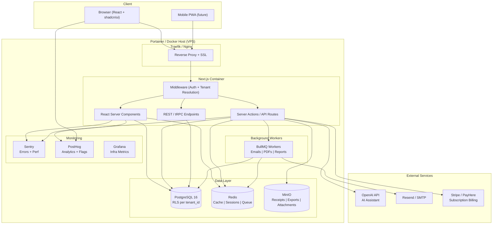

# BookOne SaaS — Architectural Plan v2.0

**Date:** 2026-06-14  
**Status:** Planning / Pre-Development  
**Target:** Next.js full-stack SaaS, self-hosted on Linux VPS via Portainer  
**Primary Market:** Sri Lanka → International

---

## 1. Multi-Tenancy Strategy

### Recommendation: **Shared Database + Row-Level Security (RLS)**

| Dimension | Decision | Rationale |
|-----------|----------|-----------|
| **Database** | Single PostgreSQL DB | Cost-efficient for bootstrapping; per-tenant DB adds significant DevOps complexity for backups, migrations, connection pooling |
| **Isolation** | Row-Level Security (RLS) on `tenant_id` | Defense-in-depth — even if application bug leaks, DB enforces tenant boundary |
| **Migration Path** | When a tenant hits ~$50K+ ARR or has regulatory needs → move to dedicated DB | Keeps early costs low, allows premium isolation for enterprise |

### Tenant ID Flow

```
Every table: tenant_id UUID NOT NULL
Every query:   WHERE tenant_id = current_setting('app.current_tenant_id')
RLS policy:    USING (tenant_id = current_setting('app.current_tenant_id')::uuid)
```

**Critical**: Set `app.current_tenant_id` at the start of every request via middleware — never trust client-side tenant selection.

### Why Not Per-Tenant Database?

- **Schema migrations** across 100 DBs is a nightmare
- **Connection pooling** — you'd need a pool per tenant or a massive shared pool
- **Cross-tenant analytics** (PostHog, usage tracking) becomes harder
- Xero and QuickBooks both started with shared DB + RLS

### When to Split

| Trigger | Action |
|---------|--------|
| Tenant has >1M transactions | Offer dedicated DB (Enterprise tier) |
| Regulatory requirement (GDPR isolated storage) | Dedicated DB |
| Tenant needs custom schema extensions | Schema-per-tenant |

---

## 2. Technology Stack

### Core

| Layer | Technology | Why |
|-------|-----------|-----|
| **Framework** | Next.js 15 (App Router) | RSC, Server Actions, streaming, edge-ready |
| **Language** | TypeScript (strict) | Type safety across the entire stack |
| **Database** | PostgreSQL 16+ | Row-Level Security, JSONB, full-text search, window functions for accounting |
| **ORM** | Drizzle ORM | Type-safe, SQL-like, great with RLS, lighter than Prisma |
| **Auth** | NextAuth.js v5 (Auth.js) | Multi-provider, session management, JWT + DB hybrid |
| **UI** | shadcn/ui + Tailwind CSS | Your choice — excellent for SaaS, accessible, customizable |
| **State** | TanStack Query (React Query) v5 | Server-state caching, optimistic updates, pagination |
| **Forms** | React Hook Form + Zod | Type-safe validation matching Drizzle schemas |

### Infrastructure

| Layer | Technology | Why |
|-------|-----------|-----|
| **Hosting** | Linux VPS + Docker + Portainer | Your choice — full control, predictable pricing |
| **Reverse Proxy** | Traefik or Nginx Proxy Manager (in Portainer) | Auto-SSL via Let's Encrypt, routing |
| **Container Orchestration** | Docker Compose (managed via Portainer) | Simple, reliable for single-VPS; move to K8s later if needed |
| **Process Manager** | PM2 or Docker healthchecks | Keep Node processes alive |
| **File Storage** | MinIO (S3-compatible, self-hosted) or VPS disk | Receipts, invoices, exports — S3-compatible for future cloud migration |
| **Cache** | Redis (via Docker) | Session store, rate limiting, query cache, job queue |
| **Job Queue** | BullMQ (Redis-backed) | Email, PDF generation, report exports, AI batch processing |

### Observability & Analytics

| Tool | Purpose | Your Choice? |
|------|---------|-------------|
| **Sentry** | Error tracking, performance monitoring | ✅ You chose it |
| **PostHog** | Product analytics, feature flags, session replays, A/B testing | ✅ You chose it |
| **Onborda** | Product tours / user onboarding | ✅ You chose it |
| **Playwright** | E2E QA testing | ✅ You chose it |
| **Grafana + Prometheus** | Server metrics, DB monitoring, alerts | Consider adding |
| **Pino / Winston** | Structured logging → stdout → Docker logs | Needed for production debugging |

### Additional Recommended Tools

| Tool | Purpose | Priority |
|------|---------|----------|
| **Resend / React Email** | Transactional emails (invoices, receipts, password resets) | High |
| **Trigger.dev** | Background job orchestration (alt to BullMQ if you want managed) | Medium |
| **Drizzle Kit** | Schema migrations with Drizzle | Required |
| **Lucia** (if not Auth.js) | Alternative auth; Auth.js v5 is solid though | Backup |
| **tRPC** or **Server Actions** | Type-safe API layer | Recommended |

---

## 3. Architecture Diagram



---

## 4. Data Flow: Request Lifecycle

```
1. Request arrives at Traefik → routes to Next.js container
2. Next.js Middleware:
   a. Parse JWT session cookie (Auth.js)
   b. Extract tenant_id from session
   c. SET app.current_tenant_id = tenant_id (PostgreSQL runtime config)
   d. Check module access (feature flags from tenant_modules)
3. Server Component / Server Action:
   a. All DB queries automatically scoped via RLS
   b. No WHERE tenant_id needed in app code (RLS enforces)
   c. PostHog.capture() for feature usage analytics
4. Response sent back
```

### Why RLS Instead of App-Level Filtering?

- **Safety**: Even if a developer forgets a `WHERE`, RLS blocks cross-tenant access
- **Performance**: PostgreSQL optimizes RLS checks into the query plan
- **Audit compliance**: Database layer guarantees data isolation

---

## 5. Module / Plugin System (Future ERP)

### Design: Feature Flags + Namespaced Schemas

The current app is **Accounting Module**. Future modules should be additive.

### Module Registry (Database)

```sql
-- Core table
CREATE TABLE modules (
    id          UUID PRIMARY KEY DEFAULT gen_random_uuid(),
    slug        VARCHAR(50) UNIQUE NOT NULL,  -- 'accounting', 'inventory', 'tax', 'pos', 'hr', 'crm', 'costing', 'websites'
    name        VARCHAR(100) NOT NULL,
    description TEXT,
    version     VARCHAR(20),
    is_core     BOOLEAN DEFAULT false,         -- Core modules can't be disabled
    created_at  TIMESTAMPTZ DEFAULT now()
);

-- Per-tenant enable/disable
CREATE TABLE tenant_modules (
    tenant_id   UUID REFERENCES tenants(id),
    module_id   UUID REFERENCES modules(id),
    is_enabled  BOOLEAN DEFAULT false,
    package_tier VARCHAR(20),  -- 'starter', 'professional', 'enterprise'
    enabled_at  TIMESTAMPTZ,
    PRIMARY KEY (tenant_id, module_id)
);

-- Module-specific tables use a naming convention:
-- {module_slug}_{table_name}
-- e.g., inventory_products, inventory_stock_movements, tax_tax_rates, hr_employees
```

### Module Activation Pattern

```typescript
// server/modules/registry.ts
const MODULE_CONFIG = {
  accounting: {
    slug: 'accounting',
    isCore: true,
    dependencies: [],
    tables: ['transactions', 'journal_entries', 'chart_of_accounts', ...],
    migrationPath: './migrations/accounting',
  },
  inventory: {
    slug: 'inventory',
    isCore: false,
    dependencies: ['accounting'],  // Inventory needs COGS accounts
    tables: ['inventory_products', 'inventory_stock_movements', ...],
  },
  tax: {
    slug: 'tax',
    isCore: false,
    dependencies: ['accounting'],
    tables: ['tax_rates', 'tax_filings', ...],
  },
  pos: {
    slug: 'pos',
    isCore: false,
    dependencies: ['accounting', 'inventory'],
  },
  hr: {
    slug: 'hr',
    isCore: false,
    dependencies: [],
  },
  crm: {
    slug: 'crm',
    isCore: false,
    dependencies: ['accounting'],  // Links to customers/transactions
  },
  costing: {
    slug: 'costing',
    isCore: false,
    dependencies: ['accounting', 'inventory'],
  },
  websites: {
    slug: 'websites',
    isCore: false,
    dependencies: [],
  },
} as const;

// Middleware / Server Action guard
export async function requireModule(moduleSlug: string) {
  const tenantId = getCurrentTenantId();
  const module = await db.query.tenantModules.findFirst({
    where: and(
      eq(tenantModules.tenantId, tenantId),
      eq(tenantModules.moduleSlug, moduleSlug),
      eq(tenantModules.isEnabled, true)
    ),
  });
  if (!module) throw new ForbiddenError(`Module "${moduleSlug}" not enabled`);
}
```

### Cross-Module Data Dependencies

Modules reference each other via soft foreign keys:

```sql
-- transactions table already has:
--   party (customer/supplier name) → will link to CRM contacts
--   category_id → shared chart_of_accounts
--   payment_account_id → shared chart_of_accounts

-- Future: inventory_movements references transactions for COGS
-- Future: tax_filings aggregate transactions by tax_rate
```

### Route / Navigation Organization

```
app/
├── (dashboard)/
│   ├── [tenantSlug]/          ← Tenant-scoped routes
│   │   ├── accounting/        ← Core module (always on)
│   │   │   ├── transactions/
│   │   │   ├── reports/
│   │   │   ├── chart-of-accounts/
│   │   │   └── ai-assistant/
│   │   ├── inventory/         ← Enabled per package
│   │   ├── tax/
│   │   ├── pos/
│   │   ├── hr/
│   │   ├── crm/
│   │   └── settings/
│   └── onboarding/            ← Onborda flows
├── api/                       ← Public API + MCP endpoints
└── auth/                      ← Auth.js pages
```

---

## 6. Multi-Currency & Internationalization

### Currency Strategy (Critical for LKR → International)

```
tenants table:
    base_currency VARCHAR(3) DEFAULT 'LKR'    -- Tenant's default currency
    reporting_currency VARCHAR(3)             -- Optional: consolidate to one currency for multi-entity

transactions table:
    currency VARCHAR(3)                        -- Per-transaction currency
    amount DECIMAL(15,2)                       -- In transaction currency
    base_amount DECIMAL(15,2)                  -- Converted to base_currency at transaction date rate
    exchange_rate DECIMAL(12,6)                -- Rate used for conversion

exchange_rates table:
    from_currency, to_currency, rate, effective_date
```

- Store exchange rates daily (fetch from API or manual entry for Sri Lankan banks)
- All reports run in base_currency using `base_amount`
- Multi-currency P&L and Balance Sheet with currency selector

### i18n

- **next-intl** — Best for Next.js App Router, supports server + client
- Translating into Sinhala (සිංහල) and Tamil (தமிழ்) is essential for Sri Lanka
- Arabic (RTL) for Middle East expansion
- shadcn/ui works with RTL via Tailwind config

---

## 7. API Strategy for Integration

### Three API Tiers

| Tier | Protocol | Use Case |
|------|----------|----------|
| **Internal API** | Server Actions + tRPC | Next.js frontend ↔ backend |
| **Public REST API** | REST with API keys | Third-party integrations, mobile apps, websites module |
| **MCP (Model Context Protocol)** | MCP stdio/HTTP | AI agents connecting to accounting data |

### API Authentication

```
tenants table:
    api_key VARCHAR(64) UNIQUE                -- Per-tenant API key for REST
    api_key_last_rotated TIMESTAMPTZ
    webhook_url VARCHAR(255)

api_keys table (fine-grained):
    id, tenant_id, name, key_hash, scopes[], expires_at, created_by
```

Rate limiting via Redis: `rate_limit:{tenant_id}:{endpoint}:{window}`

### MCP Server (for AI Agent Integration)

Run as a separate Node process alongside Next.js:

```
mcp-server/
├── tools/
│   ├── get-transactions.ts     ← Query transactions by date/type
│   ├── create-invoice.ts       ← Create sale + send to customer
│   ├── get-pnl.ts              ← Generate P&L report
│   ├── get-balance-sheet.ts    ← Current balance sheet
│   └── search-accounts.ts     ← Search chart of accounts
└── index.ts                    ← MCP server entry
```

This allows AI agents (Claude, Cursor, custom) to directly interact with the user's accounting data.

---

## 8. Scaling Strategy

### Phase 1: Single VPS (0 → 100 tenants)

```
VPS (4 vCPU, 8GB RAM, 100GB SSD)
├── Docker Compose
│   ├── nextjs (2 replicas)      ← Scale with Node cluster
│   ├── postgres (single)         ← Tuned for 8GB RAM
│   ├── redis                     ← Cache + sessions
│   ├── minio                     ← File storage
│   └── traefik                   ← Reverse proxy
└── Daily pg_dump → MinIO/S3 backup
```

### Phase 2: Separate DB (100 → 1,000 tenants)

- Move PostgreSQL to dedicated node (or managed like Supabase)
- Add read replicas for reporting queries
- Redis cluster for cache + queues

### Phase 3: Multi-Region (1,000+ tenants)

- CDN for static assets (Cloudflare)
- Regional DB replicas (Singapore for Asia, Frankfurt for EU)
- Connection pooling via PgBouncer
- Enterprise tenants → dedicated databases

### Performance Targets

| Metric | Target |
|--------|--------|
| Transaction list (50 rows) | <200ms server, <500ms total |
| Report generation (1 year P&L) | <2s |
| Journal entry creation | <500ms (within DB transaction) |
| Page load (LCP) | <2.5s |
| AI assistant response | Streaming, first token <2s |

### Caching Strategy

```
Redis Cache Keys:
├── reports:{tenant_id}:{report_type}:{date_range}:{hash}  (TTL: 15min)
├── chart_of_accounts:{tenant_id}                           (TTL: 1hr)
├── categories:{tenant_id}                                  (TTL: 1hr)
├── departments:{tenant_id}                                 (TTL: 1hr)
├── rate_limit:{tenant_id}:{endpoint}:{window}
└── session:{session_id}
```

Invalidation: Any transaction mutation → clear all report caches for that tenant.

---

## 9. Development Workflow

### Monorepo Structure

```
bookone/
├── apps/
│   ├── web/                  ← Next.js app
│   ├── mcp-server/           ← MCP server for AI agents
│   └── workers/              ← BullMQ background workers
├── packages/
│   ├── db/                   ← Drizzle schemas + migrations
│   ├── accounting/           ← Core accounting logic (journal generation, P&L calc)
│   ├── auth/                 ← Auth.js configuration
│   ├── modules/              ← Module registry + shared module utilities
│   ├── email/                ← React Email templates
│   ├── api-client/           ← TypeScript SDK for public REST API
│   └── ui/                   ← Shared shadcn/ui components
├── docker/
│   ├── Dockerfile.web
│   ├── Dockerfile.workers
│   ├── docker-compose.yml
│   └── docker-compose.prod.yml
├── scripts/
│   ├── seed.ts               ← Seed data for development
│   ├── migrate.ts            ← Drizzle migration runner
│   └── backup.sh             ← DB backup script
├── playwright/               ← E2E tests
└── docs/
    └── architecture.md       ← This document
```

### Tooling Choices

| Tool | Purpose |
|------|---------|
| **Turborepo** | Monorepo build orchestration |
| **pnpm** | Package manager (strict, fast) |
| **Biome** | Linting + formatting (faster than ESLint/Prettier) |
| **Vitest** | Unit + integration tests |
| **Playwright** | E2E tests (your choice) |
| **Lefthook** | Git hooks for lint/test on commit |
| **Drizzle Kit** | Schema migrations + visualizer |

---

## 10. Package / Subscription Tiers

Since you're a SaaS, plan tiers from day one:

| Tier | Modules | Users | Transactions/mo | Price Point |
|------|---------|-------|-----------------|-------------|
| **Starter** | Accounting (basic) | 1 | 500 | Free / Low |
| **Professional** | Accounting (full), Tax, Reports | 5 | 5,000 | Mid |
| **Business** | + Inventory, CRM | 10 | 20,000 | Higher |
| **Enterprise** | All modules, Dedicated DB, MCP access, White-label | Unlimited | Unlimited | Custom |

### Implementation:

```sql
CREATE TABLE plans (
    id          UUID PRIMARY KEY,
    name        VARCHAR(100),
    slug        VARCHAR(50) UNIQUE,
    max_users   INT,
    max_monthly_txns INT,
    price_monthly DECIMAL(10,2),
    price_yearly  DECIMAL(10,2),
    included_modules UUID[]  -- Array of module IDs
);
```

---

## 11. Security Considerations

| Concern | Mitigation |
|---------|------------|
| **Tenant isolation** | PostgreSQL RLS + middleware tenant resolution + never trust client |
| **API authentication** | Scoped API keys with expiration + HMAC signing |
| **Invoice/receipt access** | MinIO presigned URLs (expiring), not public paths |
| **SQL injection** | Drizzle ORM parameterized queries + RLS |
| **CSRF** | Next.js Server Actions built-in CSRF protection |
| **Rate limiting** | Redis-based per-tenant, per-endpoint |
| **Secrets** | Docker secrets / environment variables, never in code |
| **Backups** | Daily pg_dump encrypted, stored to MinIO, rotated 30 days |
| **Data export (GDPR)** | Per-tenant full export (all tables scoped to tenant_id) |

---

## 12. What You're Missing in Your Stack

Your proposed stack is solid. Here are gaps to fill:

| Gap | Recommendation | Priority |
|-----|---------------|----------|
| **Email delivery** | Resend (simple API, React Email templates) | High — needed for password resets, invoice emails |
| **Background jobs** | BullMQ (Redis) — for PDF generation, report exports, AI processing | High |
| **Subscription billing** | Stripe (international) + PayHere (Sri Lanka) — dual payment gateway | High |
| **Structured logging** | Pino → Docker stdout → can be shipped to Grafana/Loki | Medium |
| **Infrastructure monitoring** | Grafana + Prometheus for DB query stats, CPU, memory | Medium |
| **API documentation** | OpenAPI/Swagger for public REST API (generated from route handlers) | Medium |
| **Feature flags** | PostHog feature flags (you already have PostHog!) — use for gradual rollouts | Medium |
| **PDF generation** | Puppeteer or react-pdf for invoices, reports | Medium |
| **Database backup** | pg_dump cron job or pgBackRest for point-in-time recovery | High |
| **CI/CD** | GitHub Actions → build Docker → deploy to Portainer webhook | High |

---

## 13. First Steps (Recommended Order)

1. **Scaffold monorepo** with Turborepo + pnpm
2. **Set up Docker Compose** with PostgreSQL, Redis, MinIO
3. **Create Drizzle schema** for core tables (tenants, users, chart_of_accounts, journal_entries, transactions)
4. **Implement Auth.js** with tenant-aware sessions
5. **Port the journal generation logic** from `includes/accounting.php` → `packages/accounting/`
6. **Build the transaction page** as first working feature (shadcn/ui table + Server Actions)
7. **Add Sentry + PostHog** early to catch issues from day one
8. **Set up CI/CD** to auto-deploy to your VPS via Portainer

---

## 14. Open Questions to Decide

1. **URL structure**: `app.clossyan.com/[tenant-slug]` or `[tenant-slug].clossyan.com`? (Subdomain is cleaner for white-label but more DNS setup)
2. **Auth providers**: Just email/password? Or Google/Apple SSO? (Auth.js supports both)
3. **Pricing for Sri Lanka**: Will you use PayHere (local) + Stripe (international) dual gateway?
4. **Data residency**: For future EU customers, will you need a Frankfurt VPS? (Plan for it in infrastructure-as-code)
5. **Open-source core?**: Many SaaS companies open-source the core and charge for cloud/enterprise (consider licensing)
