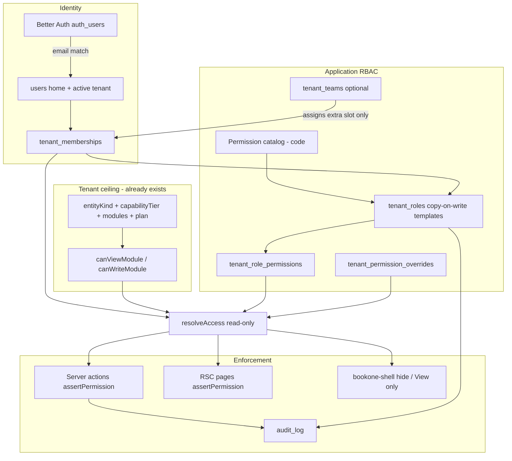
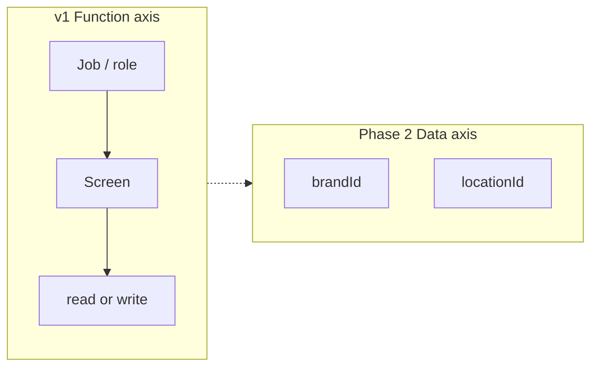
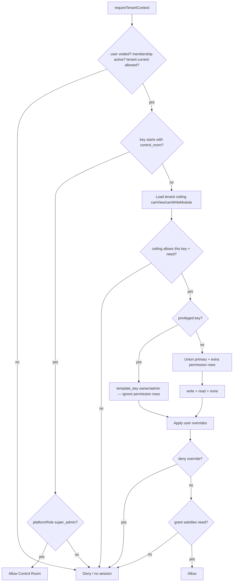
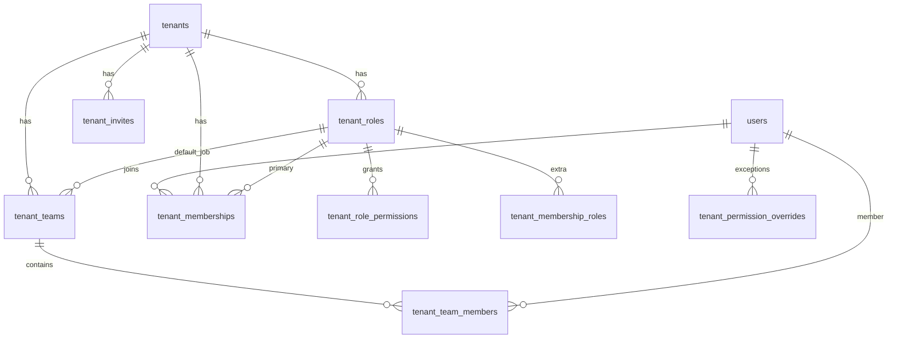

# BookOne Tenant User Access Control (RBAC)

| Field | Value |
|-------|--------|
| **Document** | Tenant team access — jobs, permissions, invites |
| **Author** | Engineering (draft for review) |
| **Date** | 2026-09-10 |
| **Revised** | 2026-09-10 (review round 3) |
| **Status** | Implemented (v1 shipped 2026-09-11; PR-6 groups/SoD/history; PR-9 shop scope 2026-09-11) |
| **Audience** | Senior engineers who know BookOne (`AGENTS.md`, auth, RLS, shell) |
| **Repo** | https://github.com/Dinu-Sri/BookOne |
| **Related** | `packages/auth/src/session.ts`, `packages/db/src/schema/users.ts`, `packages/db/src/schema/company-settings.ts`, `apps/web/src/lib/module-access.ts`, `apps/web/src/lib/entity-kind.ts`, `apps/web/src/components/layout/bookone-shell.tsx`, `docs/E2E_GOVERNANCE.md` |

---

## Overview

BookOne is a multi-tenant SME ERP. Today every person in a company that has Inventory switched on can write Inventory. `users.role` (`admin` / `member` / `super_admin`) and `tenant_memberships.role` (`owner` / …) both exist and disagree. There is no invite flow, no job templates, and no screen-level ACL. Control Room Access (`/control-room/access`) is a **platform** user list for `super_admin`, not tenant team management.

This design adds **RBAC with a code-defined permission catalog**, operated as **jobs** (roles) rather than 200 checkboxes. A tenant admin picks a job for each person (Owner, Accountant, Sales, Cashier, …), optionally adds one extra job, and sees a live preview of that person’s nav. Enforcement happens on **server actions and RSC pages** (`assertPermission('sales.invoices.write')`), not only by hiding sidebar links. Tenant module flags **and** entity capability (`canWriteModule` / `canViewModule`) remain the **ceiling**: a role cannot grant POS if the company does not have POS, and sole-lite cannot write inventory/POS even when those flags stay true for history.

Staff does **not** live under Parties (customers/vendors). It lives under **Company → Team**. Groups exist only as a convenience to assign the same job to several people — not as a second permission engine. Privileged keys (`team.*`, ownership transfer, archive, company reset) never arrive via extra jobs or teams.

---

## Background & Motivation

### Current identity (verified)

| Layer | What exists | File |
|-------|-------------|------|
| Login | Better Auth (`auth_users`, sessions, Google, email verify/reset) | `packages/auth/src/auth.ts` |
| App user | `users` (`tenant_id`, email, name, `role varchar default 'member'`) | `packages/db/src/schema/users.ts` |
| Session | `SessionUser.role` is **`users.role`**, not membership | `packages/auth/src/session.ts` `getSession` / `requireTenantContext` |
| Signup | New email → new tenant (`entityKind: pending`) + `users.role = 'admin'` + membership `role: 'owner'` | `ensureBookOneUser` |
| Multi-workspace | `tenant_memberships` (tenantId, userId, role default `'owner'`, status) | `packages/db/src/schema/company-settings.ts` |
| Switcher | Updates **`users.tenantId`** after membership check | `apps/web/src/app/actions/workspace-switch.ts` |
| Seed | Platform operator `users.role = 'super_admin'`; **no membership row** | `packages/db/src/seed.ts`, migration `007_super_admin_role.sql` |
| Better Auth orgs | Plugin enabled (`auth_organizations`, `auth_members`, `auth_invitations`) | **Unused** by BookOne tenants |

Two role columns already fight:

- Signup: `users.role = 'admin'`, membership `role = 'owner'`.
- `getTenantInfo()` exposes `userRole: user.role` (`apps/web/src/app/actions/workspace.ts`).
- Workspace switcher displays **membership** role.
- Live tenant-privilege checks still read `user.role`: `reset-company.ts` `isPrivileged` (`admin \| owner \| super_admin`), `rental-bookings.ts` `canOverrideOverlap` (`super_admin \| owner \| admin`), `company-settings.ts` `ensureMembership(..., user.role === 'admin' ? 'owner' : user.role)`, `commercial-docs.ts` passes `userRole: user.role` into rental overlap.
- Control Room pages and `bookone-shell.tsx` also hardcode `dinu.sri.m@gmail.com` as a bypass.

### Current authorization (verified)

1. **Tenant ceiling** — `tenants.modules` JSON (`sales`, `purchase`, `inventory`, `pos`, `rental`, `hr`) + entity kind (`personal` / `sole_prop` / `company` / `pending`) + capability (`lite` / `full`). `canViewModule` / `canWriteModule` in `apps/web/src/lib/entity-kind.ts` already deny inventory/POS **writes** for sole lite even when module flags remain true (history after downgrade). Nav in `bookone-shell.tsx` filters suites via `suiteModuleKey` / `isPosNavItem` / `isRentalNavItem`. Accounting + Company are always on.
2. **`assertModuleWrite`** (`apps/web/src/lib/module-access.ts`) — checks **entity kind + module flags**, not the logged-in person’s job. Call sites today: inventory writes, product categories, POS session. **`createCommercialDocument` does not call it.** Payments live in `documents.ts` (`payVendorBills`, `receiveCustomerPayments`, `allocateDocumentPayment`) — also ungated by job. Any member of a company with Sales on can post invoices.
3. **RLS** — `app.current_tenant_id` isolation on tenant tables. The app DB role is the table owner (`POSTGRES_USER=bookone`); policies are **not** `FORCE ROW LEVEL SECURITY`, so the owner bypasses RLS. Application code still sets tenant context. **Do not encode per-user screen ACL in RLS in v1.**

### What is not implemented

- Tenant invite / accept (roadmap item 20 in `docs/PROJECT_STATUS.md`; task log: “Add role-managed team invitations”).
- Groups, permission catalog, screen-level ACL.
- Tenant Team UI. Parties = customers + vendors (`packages/modules/src/index.ts`, `bookone-shell.tsx`). `/parties` redirects to customers.
- Seat limits by entity kind.
- Audit of access changes (financial mutations already write `audit_log`).

### Pain

Sri Lankan SMEs will hire a cashier, a storekeeper, and maybe an accountant. Today those people would get a full owner-shaped login the moment we add “invite a user” without jobs. The product request (permissions on groups **and** users **and** roles, under Parties) would make that worse: three places to fight, SAP-grade UI, and staff mixed into AR/AP masters.

---

## Goals & Non-Goals

### Goals (v1)

- Tenant Owner/Admin can invite people, assign a **job**, and see what that person can open.
- Deny-by-default permission catalog: `module.screen.action` with `read` | `write` (write implies read).
- Seeded job templates, copy-on-write so tenants can tweak without forking code.
- At most **one** extra job + rare per-user allow/deny **exceptions** (visible, not a hidden matrix).
- Teams/groups = “assign this job to these people,” not a second ACL. Teams cannot grant Owner/Admin.
- Enforce on server actions **and** RSC page loads; hide nav the user cannot read; **View only** badge when read without write.
- Audit invites, role changes, overrides, deactivations in the same PRs that ship those mutations.
- Existing single-user companies keep working (Owner = full access).
- Personal entity: no team. Sole lite: small seat cap. Company: many.
- Platform `super_admin` grants **only** Control Room; tenant screens always use the membership job + ceiling. Tenants cannot mint `super_admin`.
- Additive SQL only; never hard-delete financial data; never bypass tenant RLS.

### Non-goals (v1)

- SAP PFCG, authorization objects, generated profiles, composite/derived role UI.
- Independent permission matrices on users **and** groups **and** roles.
- ABAC (amount thresholds, time-of-day, IP).
- Field-level security (hide unit cost from cashier / warehouse). Warehouse sees product prices if they can edit products.
- Record rules / org levels (brand, location, warehouse) — **designed, not built**.
- Putting staff under Parties or turning HR module flags into login access.
- Dual-writing Better Auth `auth_organizations` as source of truth.
- Encoding screen ACL in Postgres RLS.
- Blocking SoD conflicts (warn only; not on Owner/Admin templates).
- Approvals workflow (`approve` / `void` / `export` as first-class actions) — catalog reserves the names. v1 `approvePurchaseDocument` uses the document’s `.write` key.
- Impersonation (Control Room P2).
- Billing per named user (plan + module flags remain the commercial ceiling; seats are a product cap, not Stripe).

---

## Industry comparison

| Dimension | SAP S/4HANA PFCG | Odoo groups | BookOne (this design) |
|-----------|------------------|-------------|------------------------|
| Audience | Consultants, Fortune / large mid-market | SMB with a partner/implementer | Sri Lankan SME, non-accountant, 1–15 people |
| Assignment unit | Role (single / composite / derived) assigned in SU01 | Group; users collect groups | **One primary job** (+ optional one extra job, + rare exceptions) |
| Permission grain | Authorization objects (`ACTVT` 01/02/03) + org fields | Model ACL (CRUD) + record rules | **`module.screen.action`** mapped to nav items; sub-routes inherit or have their own key (see catalog table) |
| Org restriction | Derived roles (company code, plant) | Record rules (own docs, warehouse) | **Phase 2**: brand/location on documents (`locationId` already exists; POS has location only) |
| Profiles | Generated from roles; never assign raw objects | n/a | No profile generator |
| UX | Transaction codes, object names | Technical group names, Access Rights matrix | Plain language: “Who can use BookOne”, “Jobs”, “No access / View only / Can edit” |
| SoD | GRC, heavy | Informal | Light banner if one person books bills **and** pays vendors (not on Owner/Admin templates) |
| Wildcards / SAP_ALL | Famous foot-gun | `base.group_system` | No `*`. Owner is a named **primary** template, auditable; extras cannot mint it |
| What we steal | Job as container; don’t assign raw objects; org as a **second** axis | Groups inherit; Viewer/Operator/Manager; one job group per person | Both ideas, neither UI |
| What we refuse | PFCG, 200 checkboxes/user, derived-role workbench | Piling groups until nobody knows why a button shows | Three competing matrices (user sketch) |

**NetSuite / Business Central lesson:** named roles on one axis, subsidiary/location on another, license tier as ceiling. BookOne already has plan + `tenants.modules` + entity kind as the commercial/product ceiling. Do not invent a second license object in v1.

---

## Proposed Design

### Mental model (what we tell the owner)

> People have a **job**. A job says which screens they can **view** or **edit**. You can put several people in a **team** so they share a job. You almost never tick boxes per person. BookOne will not let a job turn on a module you have not bought/enabled.

### Layers (deny by default)

```text
1. Authenticated + users.voided_at IS NULL + membership status=active in current workspace
2. Tenant ceiling: entity kind + capability + tenants.modules + plan
   (same helpers as today: canViewModule / canWriteModule — sole lite cannot write inventory/POS)
3. Union of grants from primary job + at most one extra job
   (privileged keys: primary Owner/Admin only; extras/teams cannot grant them)
4. User exceptions: deny wins over grant; allow only adds a non-privileged key
5. Last-owner / platform guards (cannot demote last primary Owner, cannot mint super_admin)
```

Never silent: denied **writes** throw / `{ error }` on actions. Denied **reads** on RSC **redirect** to home with `?denied=1` (toast) — they must not `throw` into `error.tsx`. Unmapped `documentType` or unmapped mutating action = **deny**.

### Architecture





### Permission catalog (code-defined, versioned)

Live in `packages/auth/src/permissions/catalog.ts` (auth package already owns session). Re-export from `@bookone/auth`. **Do not store the catalog in Postgres** — tenants store *which keys a job grants*, not the list of possible keys.

Format: `module.screen.action`.

- `module` ∈ `accounting | parties | sales | purchase | inventory | pos | rental | company | team`
- `screen` maps to a **nav item** in `navSuites` (`bookone-shell.tsx`). Sub-routes either **inherit** the parent key or have their **own** key (table below). This is not a literal 1:1 of every App Router file.
- `action` v1: `read` | `write`. **Write implies read** in the resolver (store only `write` if both).
- Reserved (not enforced v1): `approve`, `void`, `export`

`packages/modules/src/index.ts` is **stale** (no payments, aging, GRN, rental, company). The catalog + shell become the screen source of truth. Do not add a third registry.

**Unit test (PR-1):** every `href` in `navSuites` plus the runtime-injected Cashbook item maps to a `PermissionKey` (or is explicitly public / excluded).

#### Catalog v1 — nav items and inheritance

| Key | Nav / canonical route | Sub-routes | Inherit vs own |
|-----|----------------------|------------|----------------|
| `accounting.simple_entry.read/write` | `/` | — | own |
| `accounting.cashbook.read/write` | `/cashbook` | `/cashbook/summary`, `/cashbook/settings` | inherit cashbook |
| *(import inherits cashbook.write)* | | `/cashbook/import`, `/cashbook/import-studio`, `/cashbook/bank-imports`, `/cashbook/match` | inherit **`accounting.cashbook.write`** (high-power; not a Viewer write) |
| `accounting.dashboard.read` | `/dashboard` | — | own |
| `accounting.transactions.read` | `/transactions` | — | own |
| `accounting.journal.read` | `/journal` | — | own |
| `accounting.reports.read` | `/reports` | — | own (CSV export later `export`) |
| `accounting.accounts.read/write` | `/accounts` | — | own |
| `accounting.reconciliation.read/write` | `/reconciliation` | `/cashbook/recon`, `/cashbook/recon/[sessionId]/**` | inherit recon |
| `parties.customers.read/write` | `/parties/customers` | `/new`, `/[id]/edit` | inherit |
| `parties.vendors.read/write` | `/parties/vendors`, `/purchase/suppliers` | `/new`, `/[id]/edit` | inherit; suppliers **alias** of vendors |
| `sales.quotations.read/write` | `/sales/quotations` | `/new`, `/[id]` | inherit |
| `sales.orders.read/write` | `/sales/orders` | `/new`, `/[id]` | inherit |
| `sales.invoices.read/write` | `/sales/invoices` | `/new`, `/[id]` | inherit |
| `sales.payments.read/write` | `/sales/payments` | `/new` | inherit |
| `sales.aging.read` | `/sales/aging` | — | own |
| `sales.returns.read/write` | `/sales/returns` | `/new`, `/[id]` | inherit |
| `sales.discounts.read/write` | `/sales/discounts` | `/new` | inherit |
| `pos.terminal.write` | `/pos` | `/pos/customer-display` | inherit terminal |
| `pos.history.read` | `/sales/pos` | `/pos/receipt/[id]` | inherit history |
| `pos.shift.write` | *(no suite label; close-of-day)* | `/pos/z-report/[shiftId]`, close-shift action | **own** (Cashier has this) |
| `purchase.orders.read/write` | `/purchase/orders` | `/new`, `/[id]` | inherit |
| `purchase.receipts.read/write` | `/purchase/receipts` | `/new`, `/[id]` | inherit |
| `purchase.bills.read/write` | `/purchase/purchases` | `/new`, `/[id]` | inherit |
| `purchase.expenses.read/write` | `/purchase/expenses` | `/new` | inherit |
| `purchase.import.read/write` | `/purchase/import` | `/new`, `/[id]` | inherit |
| `purchase.returns.read/write` | `/purchase/returns` | `/new`, `/[id]` | inherit |
| `purchase.payments.read/write` | `/purchase/payments` | `/new` | inherit |
| `purchase.aging.read` | `/purchase/aging` | — | own |
| `inventory.products.read/write` | `/inventory/products` | `/new`, `/[id]` | inherit |
| `inventory.categories.read/write` | `/inventory/categories` | — | own |
| `inventory.levels.read` | `/inventory/levels` | `?low=1` | inherit (low stock is a filter) |
| `inventory.ledger.read` | `/inventory/ledger` | — | own |
| `inventory.transfers.read/write` | `/inventory/transfers` | `/new` | inherit |
| `inventory.adjustments.read/write` | `/inventory/adjustments` | `/new` | inherit |
| `rental.calendar.read/write` | `/inventory/calendar` | — | own |
| `rental.dispatch.read/write` | `/inventory/on-rent` | `/inventory/on-rent/[documentId]/packing` | inherit dispatch. **`?fleet=on_rent` on levels stays `inventory.levels.read`** — different screen |
| `company.details.read/write` | `/company/details` | — | own |
| `company.tax.read/write` | `/company/tax` | — | own |
| `company.sales_settings.read/write` | `/company/sales` | — | own |
| `company.purchase_settings.read/write` | `/company/purchase` | — | own |
| `company.inventory_settings.read/write` | `/company/inventory` | — | own |
| `company.rental_settings.read/write` | `/company/rental` | — | own |
| `company.brands.read/write` | `/company/brands` | — | own |
| `company.locations.read/write` | `/company/locations` | — | own |
| `company.domains.read/write` | `/company/domains` | — | own |
| `company.lifecycle.write` | *(settings cards / Add company)* | `entity-lifecycle.ts`, `createCompany` | **own; primary `template_key = owner` only** |
| `company.reset.write` | *(Company reset button)* | `reset-company.ts` tenant wipe | **own; primary Owner only** |
| `team.people.read` | `/company/team` | `/company/team/[userId]` | own (view roster) |
| `team.people.write` | `/company/team` | invite, deactivate, assign job | own; **primary Owner or Admin only** |
| `team.jobs.read` | `/company/team/jobs` | `/company/team/jobs/[roleId]` | own |
| `team.jobs.write` | `/company/team/jobs` | save matrix | own; **primary Owner or Admin only** |
| *(not in catalog)* | `/docs`, `/docs/**` | middleware `isPublicPath` | **Public. Do not ACL. Shell Documentation always visible.** |
| *(not in catalog)* | `/e2e`, `/login`, `/onboarding`, `/invite`, `/invite/complete` | public / session flows | `/invite/*` added to `isPublicPath` in PR-5; post-auth landing for invitees |
| `control_room.*` | `/control-room/*` | **not in tenant catalog** | `platformRole === 'super_admin'` only |

Low stock shares `inventory.levels`. Fleet filter on levels is **not** dispatch.

**Ceiling clip (must use existing helpers):**

```ts
// Conceptual — packages/auth/src/permissions/resolve.ts
function ceilingAllows(tenant: TenantInfo, key: PermissionKey, need: 'read' | 'write'): boolean {
  const mod = moduleOf(key); // sales | purchase | inventory | pos | rental | accounting | ...
  if (mod === 'pos' || mod === 'inventory' || mod === 'sales' || mod === 'purchase' || mod === 'rental') {
    const kind = parseEntityKind(tenant.entityKind);
    if (need === 'read') return canViewModule(kind, tenant.modules, mod);
    return canWriteModule(kind, tenant.capabilityTier, tenant.modules, mod);
  }
  if (parseEntityKind(tenant.entityKind) === 'personal') {
    return key.startsWith('accounting.cashbook') || key.startsWith('accounting.simple_entry')
      || key.startsWith('accounting.reports') || key.startsWith('accounting.transactions');
  }
  return true; // accounting + company + team still job-gated
}
```

`assertModuleWrite('inventory')` stays a wrapper: **ceiling `canWriteModule` + at least one inventory `*.write` job grant**. Replacing it with “job says write and `modules.inventory === true`” would let sole-lite Owners edit stock after a downgrade — a product regression.

**Unit test (PR-1):** `entityKind=sole_prop`, `capabilityTier=lite`, `modules.inventory=true`, Owner job → `inventory.products.write` **denied**, `inventory.products.read` **allowed**. Same for `pos.terminal.write`.

#### Catalog versioning

`CATALOG_VERSION = 1` integer in code. When a new screen ships, update templates in code.

**`resolveAccess` is read-only.** It never `INSERT`/`UPDATE`s role permission rows. Implicit writes on every RSC/action would lock, audit-spam, and change grants mid-session.

Template catch-up happens on:

- Additive migration when we bump `CATALOG_VERSION` in a release that adds screens, **or**
- First Team admin action (`listJobs` / `saveJobMatrix` / first Team visit) that finds `template_key IS NOT NULL AND customized_at IS NULL AND template_version < CATALOG_VERSION`.

Customized jobs (`customized_at` set): **deny the new key** (deny by default) and show an Owner banner: “New screen: Receive Payments. Add it to Sales?”

### Jobs (roles)

Tenant-scoped rows, seeded from **`packages/auth/src/permissions/templates.ts`** (source of truth) on migration for existing tenants and on tenant create. The table below must match that file; PR-1 snapshot-tests each `template_key` → key set.

Privileged keys are granted from the primary job’s **`template_key`**, not from `tenant_role_permissions` rows and not from overrides. `customized_at` does not matter. Implement:

```ts
function privilegedLevel(primaryTemplateKey: string | null, key: PermissionKey): AccessLevel {
  if (key === 'team.people.write' || key === 'team.jobs.write' || key === 'team.people.read' || key === 'team.jobs.read') {
    return primaryTemplateKey === 'owner' || primaryTemplateKey === 'admin' ? (key.endsWith('.write') ? 'write' : 'read') : 'none';
  }
  if (key === 'company.lifecycle.write' || key === 'company.reset.write') {
    return primaryTemplateKey === 'owner' ? 'write' : 'none';
  }
  return 'none'; // not privileged — caller uses permission rows
}
```

Ignore those keys if they appear on permission rows or allow-overrides. Matrix UI: Team / lifecycle / reset rows **locked** on every job except Owner (lifecycle/reset) and Owner/Admin (team). Unit test: customized Cashier with a `team.people.write` permission row is still **denied**.

Privileged set:

- `team.people.read/write`, `team.jobs.read/write` — primary `template_key ∈ {owner, admin}`
- `company.lifecycle.write`, `company.reset.write` — primary `template_key = 'owner'` (covers incorporate **and** `createCompany`)

| Template key | Plain name | Who | Grant set (keys; write implies read) |
|--------------|------------|-----|--------------------------------------|
| `owner` | Owner | Founder | All catalog keys at `write` (read-only keys stay read) + all `team.*` + `company.lifecycle.write` + `company.reset.write`. Locked: last primary Owner cannot lose `team.people.write` |
| `admin` | Admin | Office manager | Same as Owner **minus** `company.lifecycle.write` and `company.reset.write`. Has `team.people.*` and `team.jobs.*`. Cannot assign the Owner job |
| `accountant` | Accountant | Books | `accounting.simple_entry.write`, `accounting.cashbook.write`, `accounting.dashboard.read`, `accounting.transactions.read`, `accounting.journal.read`, `accounting.reports.read`, `accounting.accounts.write`, `accounting.reconciliation.write`, `parties.customers.read`, `parties.vendors.read`, `sales.*.read` (all sales screens read), `purchase.*.read` (all purchase screens read, including payments **read**), `company.tax.read`. No POS, no `team.*`, no settings write except tax read |
| `sales` | Sales | Counter / sales exec | `parties.customers.write`, `sales.quotations.write`, `sales.orders.write`, `sales.invoices.write`, `sales.payments.write`, `sales.aging.read`, `sales.returns.write`, `sales.discounts.read`, `inventory.products.read`, `inventory.levels.read`. No purchase, no journal write, no team |
| `purchasing` | Purchasing | Buyer | `parties.vendors.write`, `purchase.orders.write`, `purchase.receipts.write`, `purchase.bills.write`, `purchase.expenses.write`, `purchase.import.write`, `purchase.returns.write`, `purchase.aging.read`, `inventory.products.read`, `inventory.levels.read`. **No** `purchase.payments.write`. No sales, no team |
| `warehouse` | Warehouse | Storekeeper | `inventory.products.write`, `inventory.categories.write`, `inventory.levels.read`, `inventory.ledger.read`, `inventory.transfers.write`, `inventory.adjustments.write`, `purchase.receipts.write`, `rental.dispatch.write` (clipped if rental off). Product write includes prices (field-level security is a non-goal). No AP/AR, no company settings, no team |
| `cashier` | Cashier | POS | `pos.terminal.write`, `pos.history.read`, `pos.shift.write`, `sales.invoices.read`, `sales.payments.write`, `parties.customers.read`. No `sales.returns.*` (returns/void not granted; `void` is not a v1 action). No inventory write, no accounting, no team. Invoice **create** is not granted; POS sale uses `pos.terminal.write` |
| `viewer` | Viewer | Advisor / partner | `read` on every catalog key whose module is **enabled**, except `team.*`, `company.lifecycle.write`, `company.reset.write`, and all settings `*.write`. No writes |

Templates are **copy-on-write**: editing a job sets `customized_at` and copies permission rows. “Reset to BookOne default” restores from `templates.ts`.

**Owner vs Admin:** Owner is the legal/workspace principal (last-owner protection, lifecycle, reset). Admin is operational (invite, jobs, day-to-day writes). Both can invite. **Only a primary Owner** can transfer ownership (`assignJob` → Owner template) or archive/incorporate/reset the company.

Admin **cannot** edit the Owner job’s matrix (Open Question 3, recommendation locked as: no).

### Assignment model (one engine)

```text
User ──primary role──► Job (required)
     └──one extra────► Job (“Also help with…”)  [not owner/admin templates]
     └──exceptions──► allow/deny on a non-privileged key
Team ──role_id──────► Job (not owner/admin)  → fills the same extra slot
```

**Rejected:** permissions stored on teams independently, and a full per-user matrix as primary UX.

Rules:

- Every active membership has exactly one **primary** job.
- **v1 extras: at most one.** UI “Also help with” is that slot. Joining a team **uses that same slot** (sets extra = team’s job). If the slot is already filled with a different job, adding to the team fails with “This person already helps with {job}. Remove that extra first.” Invite-via-team may set **primary** if they have none yet.
- Teams **must not** point at `owner` or `admin` templates. Extra jobs **must not** be `owner` or `admin`. Allow-overrides **must not** grant privileged keys.
- Resolver union applies only to **non-privileged** keys. Privileged keys use `primary.template_key` only (see predicate above). A customized Cashier matrix cannot mint `team.*`.
- Last-owner count = alive memberships whose **primary** `template_key = 'owner'` (not extras, not “has `team.people.write`”).
- `assignJob` to the Owner template is an **ownership transfer**: caller’s primary job must be Owner; last-owner checks apply; cannot leave zero primary Owners.
- `deactivateMember`: only a **primary Owner** may deactivate another Owner (and never the last one). Admin may deactivate **non-Owner** jobs only.
- Exceptions: `allow` or `deny` on one catalog key. Deny wins. UI lists them as “Exceptions — only if this person is special.”
- Resolver never ORs a team ACL with a user ACL of different shapes — teams only point at jobs.

### Permission resolution



`super_admin` does **not** skip D→K for tenant screens. Control Room is a separate branch. A seeded operator browsing Clossyan ERP uses their **membership job** (Owner after backfill). Opening a customer company later (impersonation) is out of v1; if Control Room “open company” ever exists, it still must not OR `platformRole` into tenant grants.

**Memoization:** `getRequestAccess` and `getSession` wrap with `import { cache } from 'react'` (Next.js 15 RSC / server actions). One SQL round-trip with joins: membership + primary role permissions + extra role permissions + overrides + tenant ceiling columns. Typical payload: **1–2 jobs**, not 8 templates. Expected extra latency **< 5 ms**. No Redis in v1. Load: **1–15 users/tenant**.

Compatibility fallback:

- Column `tenants.rbac_enforced boolean NOT NULL DEFAULT false` (no `tenants.settings` jsonb — that column does not exist).
- While `rbac_enforced = false`, resolver treats primary Owner/Admin/legacy `member` as **full access under ceiling** (today’s behavior). Do **not** flip the flag in PR-1.
- Flip `rbac_enforced = true` in the **same deploy as PR-2** (action gates live). After that, a membership without `primary_role_id` is **Viewer** under ceiling.

### Unify the two role fields

| Field | After the full program | Transition (PR-1) |
|-------|------------------------|-------------------|
| `users.role` | Platform only: `super_admin` \| `user` | **Unchanged in PR-1.** Still `admin` / `member` / `super_admin` so `reset-company.ts`, `canOverrideOverlap`, `ensureMembership` keep working |
| `users.tenant_id` | **Home** workspace | Same |
| `users.active_tenant_id` | **Current** workspace (new nullable column) | **PR-1 switchers write this** (and dual-write `tenant_id`). Session tenant = `active_tenant_id ?? tenant_id`. After backfill the column is populated, so `??` never falls through — switchers **must** ship in PR-1 |
| `tenant_memberships.role` | Denormalized job slug | Source of truth becomes `primary_role_id`; varchar kept |
| `tenant_memberships.primary_role_id` | FK → `tenant_roles` | New |
| `SessionUser.role` | Deprecated | PR-1: **`membership.role` (job slug) falling back to `users.role`**. So `user.role === 'owner' \| 'admin'` keeps working once memberships exist. `super_admin` still wins if `users.role === 'super_admin'` |
| `SessionUser.platformRole` | `super_admin` \| `user` | Derived: `users.role === 'super_admin' ? 'super_admin' : 'user'` (email never consulted) |
| `SessionUser.jobSlug` / `jobId` | New | From primary role |

**PR-1b** (after call sites moved): `UPDATE users SET role = 'user' WHERE role IS DISTINCT FROM 'super_admin'`; grep gate: no remaining `user.role === 'admin'|'owner'|'member'` except platform `super_admin` comparisons. `ensureMembership` uses job slug / `owner` for home-tenant bootstrap, never `'user'`.

**Do not** grant Control Room via a tenant job. Never OR `user.email === 'dinu.sri.m@gmail.com'` once PR-1b ships.

### Session rejection matrix

`getSession` / `ensureBookOneUser` today return any `users` row by email with **no** `voided_at` filter and **no** membership status check. `requireTenantContext` only requires `tenantId`.

| Condition | `getSession` | `requireTenantContext` / tenant pages |
|-----------|--------------|----------------------------------------|
| No Better Auth session | `null` | throw / redirect login |
| `users.voided_at` set | `null` (do not revive via login) | n/a |
| No `users` row | Organic: `ensureBookOneUser` creates pending tenant + Owner. **Invite cookie/token present: do not insert; redirect to `/invite/complete`.** | n/a |
| Membership missing on active tenant | `getAuthIdentity()` allowed (invite accept) | `requireTenantContext` **throw / redirect home**. Exceptions: `/invite/**`; Control Room when `platformRole === 'super_admin'` |
| Membership `status != 'active'` or `voided_at` set | not a valid current workspace | reject; switcher omits it |
| `tenants.status = 'suspended'` | — | reject current workspace (existing Control Room rule) |
| `tenants.status = 'archived'` | — | allowed **only** as incorporate-history via switcher (already: list includes archived sole). Writes denied |
| `tenants.voided_at` set | — | reject |

Tests (PR-1): voided user cannot session; disabled membership cannot `requireTenantContext`; suspended tenant cannot be current; archived sole can open read-only history as today; **`switchWorkspace` / `switchActiveCompany` → `requireTenantContext().tenantId` equals the target**.

### Identity, invites, and `ensureBookOneUser`

Today any new email creates a **new pending tenant**. That is wrong for **invite-link signup**. It is **correct** for someone who ignores an invite and signs up at `/login` (they should still be able to found their own workspace).

**Accept is never inside organic `getSession`.** A pending invite must not auto-join on `/login` without the invite cookie/token.

**Auth identity ≠ BookOne `users` row.** Today `getSession` → `ensureBookOneUser` always materializes a `users` row (and a tenant). Invite accept needs the **Better Auth** email before that row exists.

| Helper | Reads | Used by |
|--------|--------|---------|
| `getAuthIdentity()` | `auth.api.getSession()` email + name only | `acceptInvite` |
| `getSessionUser()` | Auth + alive `users` row (membership optional) | rare bootstrap |
| `requireTenantContext()` | Auth + `users` + **active membership** | every ERP page/action |

Voided BookOne `users` still block accept (same email cannot re-enter as a ghost). **`acceptInvite` does not require a `users` row.** It matches Auth email to the invite, then in one TX inserts `users` + membership.

**Post-auth landing (the hole in `apps/web/src/app/login/page.tsx`):** email sign-in, signup, and Google all use `callbackURL = searchParams.get('from') || '/'` then `router.push(callbackURL)` / `authClient.signIn.social({ callbackURL })`. `/` is Simple Entry (`getTenantInfo` → `requireTenantContext`). A new invitee sent to `/` **before** `acceptInvite` either loops to `/login` or `ensureBookOneUser` founds a second tenant.

**Rule:** if `?invite=` is present **or** cookie `bookone_invite_token` is set, `callbackURL` and every `router.push` after sign-in/sign-up/OAuth **must** be `/invite/complete` (public, no `requireTenantContext`). That page calls `acceptInvite` then redirects to the invited tenant’s `homePathForEntity`. **Never `/` first.** ERP layouts stay on `requireTenantContext`.

**Middleware (PR-5 must edit `apps/web/src/middleware.ts`):** today `isPublicPath` is `/login`, `/docs`, `/e2e` only — **`/invite` is not public**. Add `/invite` and `/invite/*` (including `/invite/complete`). Unauthenticated `/invite/[token]` may `redirect('/login?invite=' + token)`. `/login` sets httpOnly cookie `bookone_invite_token` (TTL = min(7d, invite remaining); `Secure`/`SameSite=Lax`).

```mermaid
sequenceDiagram
  actor Invitee
  participant MW as middleware
  participant Login as /login?invite=
  participant Auth as Better Auth
  participant Done as /invite/complete
  participant Acc as acceptInvite

  Invitee->>MW: GET /invite/token unauthenticated
  MW->>Login: redirect /login?invite=token
  Login->>Login: httpOnly cookie; callbackURL=/invite/complete
  Invitee->>Auth: email sign-in / signup / Google
  Auth->>Done: callbackURL never /
  Done->>Acc: getAuthIdentity email + cookie/token
  Acc->>Acc: one TX: users + membership if needed
  Done->>Done: redirect invited tenant homePath
  Note over Acc: Organic /login without cookie still founds own workspace via ensureBookOneUser
```

Invite rules:

- **`acceptInvite(token)` is the only accept.** It uses **`getAuthIdentity()`** (Better Auth email/name; **not** `requireTenantContext`, **not** a pre-existing `users` row). If an alive `users` row exists, email must match; if `voided_at` is set, reject. Owner/Admin (`team.people.write` on **primary** job) creates invites.
- Cookie TTL ≤ invite TTL. Email normalized `lower(trim)` before write and lookup.
- Token: 32-byte random, store **SHA-256**, unique on `token_hash`. Raw only in the link. TTL 7 days. Resend rotates token (old hash voided).
- Invite page: **same generic error** for unknown, expired, revoked, or already-accepted tokens. Do not leak company names.
- **One transaction, no stranded user:** `acceptInvite` inserts `users` (home = invited tenant, `active_tenant_id` = invited tenant) **and** membership together when no `users` row exists. `ensureBookOneUser` must **not** insert a users row without a membership on the invite path. If the invite cookie is set, `ensureBookOneUser` **returns without creating a tenant** and callers send the user to `/invite/complete`. If the TX fails, no user row → retry on next login with cookie.
- **Recovery:** if a users row exists with **no** alive membership: (1) still-pending invite for that email → `acceptInvite` / cookie retry completes membership; (2) invite expired/revoked → `ensureBookOneUser` founds a **new pending tenant** and re-homes `tenant_id` + `active_tenant_id` (do not leave them stuck on someone else’s company).
- New user who signs up at `/login` **without** the invite cookie while an invite is pending: **found their own workspace** (today’s `ensureBookOneUser`). Invite stays pending; they can later accept and become multi-workspace.
- Existing BookOne user: never auto-accept; must open the link. Accept adds membership; does **not** change home `tenant_id`; sets `active_tenant_id` on first open of that company.
- Personal entity: API rejects invites.
- Duplicate pending invite: resend rotates token; **partial unique** `(tenant_id, lower(email)) WHERE status='pending' AND voided_at IS NULL`.
- Do **not** dual-write `auth_invitations` / `auth_organizations`.
- E2E **S-0716** must cover **email sign-in and Google**, not only “open invite link while already logged in.”

**Invite lookup vs RLS:** listing invites in Team UI uses normal tenant RLS. `acceptInvite` and the invite-route `ensureBookOneUser` branch must resolve a row **by token hash** without `app.current_tenant_id`. Today that works because the app role is table owner and RLS is not `FORCE`d. **Do not rely on that silently.** Provide `bookone_lookup_invite(token_hash text)` as `SECURITY DEFINER` `STABLE` SQL function (search_path pinned, grants to `bookone`) that returns `{ tenant_id, email, role_id, expires_at, status }` or empty. Document this as the owner-bypass for FORCE-RLS later. Team listing does not use it.

**Email uniqueness (PR-1 data cleanup, then index):**

1. `UPDATE users SET email = lower(trim(email)) WHERE email IS DISTINCT FROM lower(trim(email));`
2. **Merge, don’t just void.** For each duplicate alive email group, pick `kept` (prefer a row that already has memberships, else newest). For each `dup`:
   - `UPDATE tenant_memberships SET user_id = kept WHERE user_id = dup`. On `(tenant_id, user_id)` unique conflict: keep `kept`’s membership, void/disable `dup`’s.
   - Remap every other FK to `users(id)` onto `kept` (`tenant_invites.invited_by`, `accepted_user_id`, `audit_log.user_id`, `platform_audit_events.actor_user_id`, and any other `REFERENCES users`).
   - Then `voided_at = now()` on the `dup` **users** row (`audit_log` note).
3. `CREATE UNIQUE INDEX users_email_alive_uidx ON users (lower(email)) WHERE voided_at IS NULL;`
4. Change `ensureBookOneUser` to `lower(email)` + `voided_at IS NULL` (today it is case-sensitive `eq` and does not filter voided).

Test: two alive `users` rows sharing an email across two tenants → one login, two memberships, no dangling `tenant_memberships.user_id`.

**Re-invite of a voided / disabled person:** do **not** insert a second `users` row. Revive: clear `users.voided_at` if set; membership `status='active'`, `voided_at` null, assign job. Unique `(tenant_id, user_id) WHERE voided_at IS NULL` stays one alive membership; disabled rows keep that unique slot until voided **or** we treat disabled as the same row (recommended: **one membership row per user×tenant forever**; `status` toggles `active` / `disabled`; `voided_at` only for hard-gone mistakes).

### Users table vs RLS (must fix for team listing)

`switchWorkspace` currently **moves** `users.tenant_id`. If RLS is ever `FORCE`d, a user switched into company B disappears from company A’s `users` policy even though membership A is active. Team listing would break.

v1 additive path:

1. Add `users.active_tenant_id` (nullable). Backfill `active_tenant_id = tenant_id`. Session tenant = `active_tenant_id ?? tenant_id`. **After backfill `??` never falls through**, so both live switchers **must** write `active_tenant_id` in **PR-1** (not PR-1b):
   - `apps/web/src/app/actions/workspace-switch.ts` `switchWorkspace`
   - `apps/web/src/app/actions/company-settings.ts` `switchActiveCompany`
2. PR-1 dual-writes `tenant_id` **and** `active_tenant_id` (one release). PR-1b stops writing `tenant_id` on switch (`tenant_id` remains home).
3. List members via `tenant_memberships` ⋈ `users`, not `users.tenant_id = current`.
4. Additive RLS: extra **PERMISSIVE** policy on `users` — visible if `id IN (SELECT user_id FROM tenant_memberships WHERE tenant_id = current_setting...)`. Do not drop the old policy in v1.
5. Still **do not** put screen ACL in RLS.

Test (PR-1): switch workspace → `requireTenantContext().tenantId` is the target company (fails today if only `tenant_id` is updated).

### Feature flag / seats

No env flag required for owners. `rbac_enforced` is a **deploy latch**, not a product flag.

| Entity | Team UI | Seats (v1 proposal) | Default |
|--------|---------|---------------------|---------|
| `pending` | Hidden | 1 | Onboarding owner only |
| `personal` | Hidden | 1 | No invites. Phase 2: accountant as Viewer on cashbook |
| `sole_prop` + lite | Shown | **2** | Owner + one helper (cashier or accountant) |
| `sole_prop` + full | Shown | **5** | Typical shop |
| `company` + starter | Shown | **5** | |
| `company` + growth | Shown | **15** | |
| `company` + pro | Shown | **50** | Soft cap; Control Room can raise later |

**`team-seats.ts` contract:**

```ts
seatUsed = count(memberships WHERE status = 'active' AND voided_at IS NULL)
         + count(invites WHERE status = 'pending' AND voided_at IS NULL AND expires_at > now())
```

**Disabled (`status='disabled'`) and voided memberships do not occupy seats.** Unique `(tenant_id, user_id) WHERE voided_at IS NULL` still allows one row (the disabled row). Reactivation is `status='active'`, not a second insert. Pending invite for an email that already has a disabled membership: treat as reactivate, don’t double-count.

`hr` module remains “Employees and payroll (coming soon)” — **not** this feature.

### Where the UI lives

**Company → Team**, not Parties.

Routes:

- `/company/team` — People (`team.people.read` to view; write to invite)
- `/company/team/[userId]` — This person’s access
- `/company/team/jobs` — Jobs list (`team.jobs.read` / `.write`)
- `/company/team/jobs/[roleId]` — Matrix editor + “what this job can open”
- `/company/team/groups` — optional Teams (name + non-privileged job + members)

Shell: Company suite items **Team**, **Jobs**, gated by `team.people.read` / `team.jobs.read`.

Do not add Users under Parties. Parties stay AR/AP masters.

### UX (non-accountant)

**People list** — `workspace party-workspace` + `party-toolbar` + `Card` table per `docs/LIST_TABLE_UX_GUIDE.md`.

Columns: Name, Email, Job, Status (Active / Invited / Disabled), Last seen (optional later), Actions.

Primary CTA: **Invite person**.

**Invite dialog (3 fields):** Email, Job (select templates first; Owner job hidden unless the actor is a primary Owner transferring — actually invite-as-Owner is transfer; **invite job list omits Owner**; use a separate “Transfer ownership” on the person page). Optional Team. Helper text: “They will only see the screens for this job.”

**This person’s access:**

1. Job dropdown (templates; Owner option only for primary Owners).
2. Optional “Also help with” (**one** extra; list excludes Owner/Admin).
3. Exceptions (collapsed). Each row: screen × Allow or Block. Privileged keys omitted.
4. **Live preview** of the sidebar they would see. View-only items show a badge.
5. SoD banner **only if** the primary job is customized **or** an extra job is set. Never on stock Owner/Admin templates (those always include bills+payments and would train people to ignore the banner). Pair: `purchase.bills.write` + `purchase.payments.write`.

**Jobs matrix:**

- Rows: screens grouped by module.
- Columns: **No access** | **View only** | **Can edit**.
- Disabled/grey rows when tenant module is off **or** `canWriteModule` is false (sole lite inventory: View only locked).
- **Privileged rows locked:** Team people/jobs locked except on Owner/Admin templates. Lifecycle / reset / “Add company” locked except on Owner. Saving ticks on a Cashier job for those keys is rejected server-side even if the client tampers.
- Never show raw keys in the UI.

**Empty states:**

- First visit: “You are the only person in this company. Invite a cashier or accountant when you are ready.”
- Personal: page not linked; if hit, “Personal books are just you. Company workspaces can add a team.”

### Enforcement map

```ts
// apps/web/src/lib/module-access.ts (conceptual)
export async function assertPermission(
  key: PermissionKey,
  opts?: { surface?: 'action' | 'rsc' },
): Promise<void> {
  const access = await getRequestAccess(); // react cache()
  const need = key.endsWith('.write') ? 'write' : 'read';
  if (access.allows(key, need)) return;
  if (opts?.surface === 'rsc' && need === 'read') {
    // App Router throw Error → error.tsx, not a toast. Redirect instead.
    redirect(`${homePathForEntity(...)}?denied=1`);
  }
  throw new Error(
    need === 'write'
      ? 'You can view this, but you cannot change it. Ask the owner to change your job.'
      : 'You do not have access to this screen.',
  );
}

/** Legacy helper. Prefer the screen key on each mutate. If kept: ceiling + ANY inventory.*.write, not products.write. */
export async function assertModuleWrite(module: ModuleWriteKey): Promise<void> {
  const access = await getRequestAccess();
  const kind = parseEntityKind(/* tenant */);
  if (!canWriteModule(kind, tenant.capabilityTier, tenant.modules, module)) {
    throw new Error('This area is view-only on Sole lite. Upgrade to Sole full (or ask admin) to create or edit.');
  }
  if (!access.hasAnyWriteInModule(module)) {
    throw new Error('You can view this, but you cannot change it. Ask the owner to change your job.');
  }
}
```

PR-2 **deletes leftover `assertModuleWrite` call sites** (`inventory.ts` stock docs, `product-categories.ts`, `pos-session.ts`) and uses the **screen key** (`inventory.transfers.write`, etc.). Warehouse with transfers write and no products write must succeed on transfers. Keep the helper only if some backstop remains, implemented as **any** `inventory.*.write` plus ceiling — never `representativeWriteKey('inventory')` → products.

Fail closed: `createCommercialDocument` uses an exhaustive `switch (documentType)` with `const _e: never = documentType` in default → deny. **`customer_invoice` is not in `createSchema`’s z.enum** (`quotation` … `vendor_bill` only). Do not map it there. Legacy `documents.ts` `createDocument` uses `customer_invoice` / `vendor_bill` / `sales_invoice` — map those in **that** file.

**Side-effect writes:** `createCommercialDocument` / POS may call `ensureParty` for the **counterparty kind** of that document if the user has the **document write** key. That must not require `parties.customers.write`. It must not open the Parties master, change credit limits, or archive parties. Cashier posting a POS sale can therefore create a walk-in customer row without Parties write.

**`approve` in v1:** `approvePurchaseDocument` / `rejectPurchaseDocument` require `purchase.bills.write` (same as editing the bill). Reserved `approve` action is unused.

**Convert** uses the **target** document’s write key (inside `createCommercialDocument`). Source `.read` is required to open the source.

**Delete / archive / restore / header update** use the document’s `.write` key. (`void` as a separate action is not v1.)

Nav: `visibleSuites` filters by `access.canRead(href)`. If `canRead && !canWrite`, “(view)” badge.

**RSC:** every list/detail `page.tsx` under those routes calls `assertPermission(key, { surface: 'rsc' })` (PR-3). Read deny → `redirect(home + '?denied=1')`; shell shows a one-shot toast from that query (`StatusToast`). Do **not** `throw new Error` in RSC (that is `error.tsx`). Actions keep throw / `{ ok: false, error }` for existing `try/catch` forms. URL-guessing `/purchase/payments` as cashier never renders the payments UI.

### SoD (light)

Only on customized jobs or when an extra job is present:

- `purchase.bills.write` + `purchase.payments.write`

Do **not** block save in v1 except last-owner invariants. Do **not** banner Owner/Admin templates. Drop the noisy `sales.invoices.write` + `accounting.simple_entry.write` pair (Owners always have both). Drop `team.people.write` + payments for the same reason.

Banner copy: “This person can record supplier bills and also pay them. Many companies split those jobs.”

### Phase 2 — data scope (design now)

`locationId` / `brandId` exist on business documents, inventory, journal entries/lines, transactions; **POS registers have `locationId` only** (`packages/db/src/schema/pos.ts`) — no `brandId`. Categories gained optional brand + location in migration `030_product_category_tree.sql`.

Phase 2 adds **scope** on membership or job: `location_ids[]` / `brand_ids[]` (empty = all). Resolver AND-filters lists. POS brand is derived **register location → location.brandId**. Analogous to SAP derived roles / Odoo record rules. **Do not** mix org values into the v1 checkbox matrix.

---

## API / Interface Changes

### Session

```ts
// packages/auth/src/session.ts
export interface SessionUser {
  id: string;
  email: string;
  name: string;
  tenantId: string;          // active workspace
  homeTenantId: string;
  platformRole: 'super_admin' | 'user';
  /**
   * Transition (PR-1): membership.role ?? users.role
   * so existing user.role === 'owner'|'admin'|'super_admin' checks keep working.
   * PR-1b: stop reading this; use platformRole + jobSlug.
   */
  role: string;
  jobSlug: string;           // owner | cashier | ...
  jobId: string | null;
  membershipStatus: 'active' | 'disabled';
}
```

`requireTenantContext` implements the rejection matrix above and never trusts client `tenantId`.

Three helpers (do not collapse):

- **`getAuthIdentity()`** — Better Auth email/name. No `users` row required. **`acceptInvite` uses this.**
- **`getSessionUser()`** — Auth + alive `users` row, membership optional. Not sufficient for ERP pages.
- **`requireTenantContext()`** — Auth + `users` + active membership. Every ERP layout/action.

`/invite/**` (including `/invite/complete`) must not call `requireTenantContext` or `getTenantInfo`.

### Access helper

```ts
export type AccessLevel = 'none' | 'read' | 'write';

export interface ResolvedAccess {
  tenantId: string;
  userId: string;
  level(key: string): AccessLevel;
  allows(key: string, need: AccessLevel): boolean;
  canReadHref(href: string): boolean;
  sodWarnings: string[];
  previewNav: { suiteId: string; items: { label: string; href: string; viewOnly: boolean }[] }[];
}
```

`getRequestAccess` = `cache(async () => resolveAccess(...))`.

### Server actions (`apps/web/src/app/actions/team.ts`)

| Action | Permission | Behavior |
|--------|------------|----------|
| `listTeamPeople` | `team.people.read` | Memberships + invites |
| `inviteTeamMember({ email, roleId, teamId? })` | `team.people.write` | Seat cap, email, **audit_log**, cannot invite as Owner |
| `resendInvite` / `revokeInvite` | `team.people.write` | Rotate/void; **audit_log** |
| `acceptInvite(token)` | token; **`getAuthIdentity()`** (Auth email; no `users` row required); email must match invite | One TX: users+membership if new; **audit_log**; no extra tenant; then redirect `homePathForEntity` |
| `assignJob({ userId, primaryRoleId, extraRoleId })` | `team.people.write`; Owner job requires primary Owner | Last-owner guard; **audit_log**; `extraRoleId` optional single |
| `setOverrides({ userId, items })` | `team.people.write` | No privileged keys; **audit_log** diff |
| `deactivateMember` | `team.people.write`; **Owner target ⇒ actor primary Owner** | `status=disabled`; frees seat; never last primary Owner; Admin cannot disable Owners; **audit_log** |
| `listJobs` | `team.jobs.read` | May run template catch-up write (admin path, not resolve) |
| `saveJobMatrix` / `resetJobToTemplate` | `team.jobs.write` | Cannot edit Owner matrix unless primary Owner; privileged keys stripped unless template is owner/admin; **audit_log** |
| `createTeam` / `setTeamMembers` | `team.people.write` | Team job ≠ owner/admin; extra-slot rules; **audit_log** |

### Shell

`TenantLite` / layout loader calls `getMyAccess()` once (`cache`). Control Room visibility = `platformRole === 'super_admin'` only (email bypass removed in PR-1b).

---

## Data Model Changes

All new tables: `tenant_id NOT NULL`, `voided_at`, timestamps, RLS isolation policy matching `004_company_settings_rls.sql`. Soft-void only.



### New / altered tables

**`users` (additive)**

- `active_tenant_id uuid REFERENCES tenants(id)` nullable.
- Unique index **after** lowercase + duplicate collapse: `users_email_alive_uidx ON users (lower(email)) WHERE voided_at IS NULL`.
- Backfill `active_tenant_id = tenant_id`.
- **Do not** rewrite `role` → `'user'` in PR-1.

**`tenant_memberships` (additive)**

- `primary_role_id uuid REFERENCES tenant_roles(id)`.
- Keep `status` (`active` \| `disabled`) + `voided_at`. Disabled = not a seat, still the unique live row.
- Unique `(tenant_id, user_id) WHERE voided_at IS NULL`.

**`tenant_roles`** — as before (`template_key`, `template_version`, `customized_at`, `is_locked`). Unique `(tenant_id, slug) WHERE voided_at IS NULL`.

**`tenant_role_permissions`** — unique `(role_id, permission_key) WHERE voided_at IS NULL`. Unknown keys ignored at resolve time.

**`tenant_membership_roles`** — extra jobs. Unique `(tenant_id, membership_id) WHERE voided_at IS NULL` so at most **one** extra.

**`tenant_permission_overrides`** — `(tenant_id, user_id, permission_key)` unique alive; `effect` = `allow` | `deny`. Check constraint: permission_key not in privileged set (also enforced in app).

**`tenant_teams` / `tenant_team_members`** — Team `role_id` CHECK/app: `template_key NOT IN ('owner','admin')`.

**`tenant_invites`**

| Column | Notes |
|--------|--------|
| tenant_id, email, role_id | email stored lowercased |
| invited_by | users.id |
| token_hash | varchar(64), **UNIQUE** |
| expires_at | |
| accepted_at, accepted_user_id | |
| status | `pending` \| `accepted` \| `revoked` \| `expired` |
| voided_at | |

Partial unique: `(tenant_id, lower(email)) WHERE status='pending' AND voided_at IS NULL`.

**`tenants`**

- `rbac_enforced boolean NOT NULL DEFAULT false` — **not** flipped in PR-1. No `settings` jsonb.

### Backfill (PR-1)

1. Lowercase emails; **merge** duplicate alive users (remap FKs, then void extras); unique index.
2. For **every** tenant, insert 8 template jobs.
3. For every `users` row with `voided_at IS NULL` and home `tenant_id`: if no alive membership, **insert Owner membership** (covers `seed.ts`, which creates `super_admin` **without** a membership).
4. Map existing memberships: `owner` → Owner job; `admin` → Admin; else Owner if they are the only member, else Viewer.
5. `seed.ts` also inserts the Owner membership going forward.
6. Super_admin keeps `users.role = 'super_admin'` **and** gets an Owner job on Clossyan. Control Room does not require that job; ERP screens do.
7. Leave `users.role` values other than backfill-for-memberships alone. **Do not** set `rbac_enforced = true` here.

Migration file: `packages/db/migrations/031_tenant_rbac.sql` (next after `030_product_category_tree.sql`). Additive. RLS policies + `bookone_lookup_invite` in the same file.

### Storage estimate

~8 roles × ~50 grant rows × N tenants ≈ 400 rows/tenant. 10k tenants ≈ 4M small rows — irrelevant. Invites and overrides are sparse.

---

## Appendix: action → permission (closed checklist for PR-2)

Unlisted mutating export = **deny** until mapped. Reads on a page use the page key (PR-3 RSC). Platform files stay `platformRole === 'super_admin'`.

| File | Export (representative) | Key / rule |
|------|-------------------------|------------|
| `commercial-docs.ts` | `createCommercialDocument`, `createCommercialDocumentFromForm` | switch `documentType` below; default deny |
| | `convertDocument`, `convertDocumentAction`, `convertMultipleOrdersToInvoice`, `createReturnFromBillAction` | target type write (+ source read) |
| | `listCommercialDocuments`, `getCommercialDocument`, print helpers | matching `.read` |
| | `listOpenApBills` / `getApAgingSummary` | `purchase.payments.read` / `purchase.aging.read` |
| | `listOpenArInvoices` / `getArAgingSummary` | `sales.payments.read` / `sales.aging.read` |
| | `approvePurchaseDocument`, `rejectPurchaseDocument` (+ form) | `purchase.bills.write` |
| | `deleteCommercialDocument`, `archiveCommercialDocument`, `restoreCommercialDocument`, `updateCommercialDocumentHeaderFromForm` | that doc’s `.write` |
| | `listActiveDiscounts` | `sales.discounts.read` |
| `documents.ts` | `createDocument` / `createDocumentFromForm` | `customer_invoice`/`sales_invoice` → `sales.invoices.write`; `vendor_bill` → `purchase.bills.write` |
| | `payVendorBills` | `purchase.payments.write` |
| | `receiveCustomerPayments` | `sales.payments.write` |
| | `allocateDocumentPayment` (+ form) | AR → `sales.payments.write`; AP → `purchase.payments.write` |
| | `listDocuments` | `sales.invoices.read` **or** `purchase.bills.read` (union for the combined page; page itself is not in nav — treat as accounting.transactions.read if still routed from `/documents`) |
| `parties.ts` | list/get | role → customers/vendors `.read` |
| | `ensureParty` | if called from a document write, skip extra check; from Parties UI require `.write` |
| | create/update/archive/restore/delete | `.write` for that role |
| `inventory.ts` | list/get/levels/movements | matching `.read` |
| | create/update/archive/restore/delete product, `createQuickProduct` | `inventory.products.write` |
| | `createStockDocFromForm`, `createStockTransfer` | transfers vs adjustments `.write` |
| `product-categories.ts` | list | `.read`; mutate | `.write` |
| `discounts.ts` | list/get `.read`; create/update `.write` | |
| `pos-session.ts` | `getPosBootstrap`, `completePosSale` | `pos.terminal.write` |
| | `completePosReturn` | `sales.returns.write` **and** `pos.terminal.write` (Cashier lacks returns → denied) |
| | `listRecentPosSales`, `lookupPosSale`, `getPosReceiptData` | `pos.history.read` |
| | `openPosShift`, `closePosShift`, `getShiftZReport`, `previewShiftZReport` | `pos.shift.write` |
| `pos-registers.ts` | list/save/archive | `company.inventory_settings.write` (register master; Owner/Admin). Out of cashier. |
| `record-entry.ts` | `recordEntry`, reversals | `accounting.simple_entry.write` |
| `accounts.ts` | `getActiveAccounts` | `.read`; no write API today |
| `cashbook.ts` | list rows/totals | `accounting.cashbook.read` |
| `cashbook-banks.ts` | create/rename/archive bank | `accounting.cashbook.write` |
| `cashbook-export.ts` | `exportCashbookCsv` | `accounting.cashbook.read` (later `export`) |
| `bank-import-studio.ts` | draft/preview/commit | `accounting.cashbook.write` |
| `statement-import.ts` | preview/commit/confirm/void/skip/undo/match | `accounting.cashbook.write` |
| `reconciliation.ts` | get/create import/update line | `accounting.reconciliation.write` (get = read) |
| | `lockPeriod` | `accounting.reconciliation.write` |
| `bank-reconciliation.ts` | session/match/finish/void import/export | `accounting.reconciliation.write` (reads = `.read`) |
| `rental-bookings.ts` | calendar list | `rental.calendar.read` |
| | dispatch/return/extend/release bay | `rental.dispatch.write` |
| | `checkRentalAvailability` overlap override | primary Owner/Admin **or** `rental.dispatch.write` + not cashier; stop passing `users.role` |
| `rental-money.ts` | collect/refund deposit | `rental.dispatch.write` |
| | `invoiceHireCharges` | `sales.invoices.write` (creates invoice) |
| `rental-health.ts` | `runRentalHireLoop`, `checkRentalIntegrity` | **`platformRole === 'super_admin'` only** (called from `health-check.ts`). Ignore client `tenantId`; use the health-check run’s already-authorized tenant (never `withTenantContext(params.tenantId)` from the caller). |
| `rental-settings.ts` | get `.read` of `company.rental_settings`; save `.write` | |
| `sales-settings.ts` / `purchase-settings.ts` / `inventory-settings.ts` | get/save | matching `company.*_settings` |
| `company-settings.ts` | profile/tax/brand/location/FY | matching company keys |
| | `createCompany` | **`company.lifecycle.write` (primary Owner only)**. Hide “Add company” on `/company/details` unless that key is present. Viewer/Cashier must not mint a tenant. |
| | `switchActiveCompany` | same as `switchWorkspace`: alive membership; write `active_tenant_id` (+ dual-write `tenant_id` in PR-1) |
| | `ensureMembership` | use membership job slug, **not** `users.role === 'admin' ? 'owner' : user.role` |
| `company-domains.ts` | list/create/verify | `company.domains.*` |
| `entity-lifecycle.ts` | upgrade/downgrade/incorporate | `company.lifecycle.write` (primary Owner) |
| `entity-onboarding.ts` | `completeEntityOnboarding` | the only member of a pending tenant (no extra ACL) |
| `reset-company.ts` | `resetCurrentCompanyData` | `company.reset.write` (primary Owner) |
| | `masterResetStagingCompanyData`, `resetPlatformCompanyData` | `platformRole === 'super_admin'` |
| `upload-receipt.ts` | upload/download | same as parent document/simple-entry write/read |
| `preview-category.ts` | read-only helper | `accounting.simple_entry.read` or inventory read |
| `workspace.ts` | dashboard/reports/journal/transactions/accounts | matching accounting `.read` |
| `workspace-switch.ts` | list/switch | membership; no catalog key |
| `platform.ts`, `health-check.ts` | all | `platformRole === 'super_admin'` |
| `auth-session.ts`, `legacy-auth.ts` | login | n/a |

**`createCommercialDocument` `documentType` → key** (must match z.enum; no `customer_invoice`):

| `documentType` | Permission |
|----------------|------------|
| `quotation` | `sales.quotations.write` |
| `sales_order` | `sales.orders.write` |
| `sales_invoice` | `sales.invoices.write` |
| `sales_return` | `sales.returns.write` |
| `pos_sale` | `pos.terminal.write` |
| `purchase_order` | `purchase.orders.write` |
| `goods_receipt` | `purchase.receipts.write` |
| `purchase` / `vendor_bill` | `purchase.bills.write` |
| `import_purchase` | `purchase.import.write` |
| `cash_purchase` | `purchase.expenses.write` |
| `purchase_return` | `purchase.returns.write` |
| default | **deny** (`never`) |

---

## Alternatives Considered

### A. Three matrices (user request: permissions on groups AND users AND roles)

**Pros:** Maximum flexibility.  
**Cons:** Unusable for a 5-person shop; SoD undebuggable; “why can Nimal see Pay vendors?” has three answers. SAP-class operational cost.  
**Decision:** Reject. Exceptions are a short list, not a matrix.

### B. Odoo-style groups only (users collect many groups, groups inherit)

**Pros:** Proven SMB pattern; inheritance is powerful.  
**Cons:** Owners still end up piling groups; BookOne audience thinks in jobs (“cashier”), not “ACL groups.”  
**Decision:** Steal inheritance internally (templates → copy-on-write). UX is one primary job.

### C. ABAC / policy engine (Cedar, OPA)

**Pros:** Future amount/location/time rules.  
**Cons:** No operators, no need, latency and failure modes.  
**Decision:** Phase 2+ if ever. Catalog stays data, not a DSL.

### D. Better Auth organization plugin as source of truth

**Pros:** Invites already modeled (`auth_invitations`).  
**Cons:** BookOne tenants, memberships, RLS, and entity kinds already exist; dual-write with `auth_organizations` will drift (already unused). Better Auth roles are coarse (`owner`/`admin`/`member`).  
**Decision:** Keep Better Auth for **login only**. BookOne owns tenants, jobs, invites. Email via `sendAuthEmail`.

### E. Encode screen ACL in Postgres RLS

**Pros:** Defense in depth.  
**Cons:** Easy to get wrong; table-owner bypass today; permission keys don’t map to rows; would need `FORCE RLS` + non-owner app role first (separate hardening project).  
**Decision:** RLS stays tenant isolation. App-layer `assertPermission`. Invite token lookup uses a narrow `SECURITY DEFINER` function so FORCE later does not break accept.

### F. Put Users under Parties

**Pros:** Matches the product sketch.  
**Cons:** Parties are customers/vendors (`packages/modules`, AR/AP, credit limit, tax IDs). Staff in that list breaks accounting language and reports.  
**Decision:** **Company → Team**.

---

## Security & Privacy Considerations

| Threat | Severity | Mitigation |
|--------|----------|------------|
| Hidden nav but open server action / URL guess | **High** | `assertPermission` on mutating actions **and** RSC pages; fail closed on unmapped types |
| Privilege escalation via `users.role` | **High** | PR-1 keeps `users.role` until call sites move; PR-1b grep gate; tenant UI cannot set `super_admin` |
| Extra job / team / customized matrix mints `team.*` | **High** | Privileged keys from `template_key` only; matrix rows locked |
| Last owner demoted / Admin disables co-Owner | **High** | Count **primary** Owner jobs; only Owner may deactivate Owners |
| Invite token leak | **Med** | Hash at rest, unique hash, TTL 7d, rotate on resend, generic errors |
| Invite creates extra tenant / stranded user / post-auth `/` | **High** | `getAuthIdentity` + `/invite/complete` callback (never `/`); one TX; recovery re-homes |
| Workspace switch ignored after `active_tenant_id` backfill | **High** | Both switchers in PR-1 write `active_tenant_id` |
| Auto-join on organic login | **High** | Accept only via `acceptInvite` |
| Email enumeration | **Low** | Same generic invite-page error; rate-limit resend |
| Cross-tenant member list | **High** | List via memberships; never accept `tenantId` from the client |
| Hardcoded `dinu.sri.m@gmail.com` | **High** | Remove in PR-1b with `platformRole` |
| SoD (book + pay) | **Med** | Warn on customized/extra jobs only |
| Disabled/voided user still in session | **Med** | Rejection matrix; tests |
| Duplicate emails break unique index / orphan memberships | **Med** | Merge FKs then void; lookup `lower` + `voided_at IS NULL` |
| Catalog key typos | **Low** | Union type `PermissionKey`; nav href map test |
| RLS owner bypass | **Med** (pre-existing) | Out of v1 FORCE; `SECURITY DEFINER` for invite lookup |
| Audit gap on invites | **High** | `audit_log` in the same PR as the mutation (PR-4/PR-5), not delayed to PR-6 |
| Template catch-up writes on hot path | **Med** | Resolver read-only |

AuthZ messages must not leak other tenants’ names. Invite **email** contains company display name (already known to the inviter). Invite **page** does not.

Passwords stay in Better Auth; `users.passwordHash` remains `'better-auth-managed'` for new users.

---

## Observability

**Logs (no PII beyond user id / tenant id):**

- `rbac.deny` — `{ tenantId, userId, key, need, source: 'ceiling'|'role'|'override'|'session' }`
- `rbac.invite` — created / accepted / revoked / expired
- `rbac.role_change`

**Metrics:** `bookone.rbac.deny_total` by key; `bookone.rbac.invite_accepted_total`; `bookone.rbac.resolve_ms` (alert p95 > 20 ms).

**Alerts:** deny spike on `team.people.write`; invite accept failures; zero primary Owners on a company.

**Audit UI:** Team “Access history” in PR-6 (reads existing `audit_log`). Control Room Audit stays `platform_audit_events`.

---

## Rollout Plan

1. **PR-1** schema + resolver + membership backfill from `users.tenant_id`. `users.role` **unchanged**. `rbac_enforced` stays false. Session `role` = job slug fallback.
2. **PR-1b** call-site migration + `users.role` → `super_admin|user` + drop email bypass. Same release train as PR-1 if possible.
3. **PR-2** closed action checklist; flip `rbac_enforced=true` **in this deploy**.
4. **PR-3** nav **and** RSC `assertPermission` (same release train as PR-2 — nav hide without RSC is UX-only).
5. **PR-4** Team UI with `audit_log` on job/override/deactivate.
6. **PR-5** invites + accept path + `audit_log` + `ensureBookOneUser` invite-route skip.
7. **PR-6** groups + SoD banner + Access history UI (depends on PR-5).
8. **PR-7** E2E S-0713+.
9. **PR-9** Phase 2 location/brand — later.

**Rollback:** additive SQL; hide Team nav; if gates too strict, allow-list **primary** `owner`/`admin` slugs with audit — not a silent global disable. Never `DELETE` memberships or financial rows.

**Staging:** second login as Cashier; POS write ok; `/purchase/payments` RSC denied; owner still posts invoices; sole-lite inventory write still denied.

---

## Risks

| Risk | Severity | Mitigation |
|------|----------|------------|
| Mega-actions miss a type | **High** | Exhaustive `never` switch; appendix checklist; E2E cashier denied |
| `users.role` backfill before call sites | **High** | Not in PR-1; PR-1b grep gate |
| `ensureBookOneUser` race / stranded invitee | **High** | Unique email after merge; `acceptInvite` one TX; recovery re-home |
| PR-1 `active_tenant_id` without switcher writes | **High** | Both switchers in PR-1; dual-write `tenant_id`; session test |
| Switching `users.tenant_id` vs listing | **High** | `active_tenant_id`; membership join |
| Seed operator has no membership | **High** | Backfill from `users.tenant_id`; fix `seed.ts` |
| Unique email index fails on dupes / orphan FKs | **High** | Merge remaps FKs then void |
| Nav hide without RSC | **High** | PR-3 includes page guards; ship with PR-2 |
| Template/docs drift | **Med** | Snapshot tests vs `templates.ts` |
| Seat caps too tight | **Low** | `team-seats.ts`; Control Room override later |
| E2E logs in as owner only | **High** | Cashier fixture + deny scenarios |

---

## Open Questions

1. **Exact seat caps** for sole full / company plans — proposed 2 / 5 / 5 / 15 / 50. Product to confirm.
2. **Accountant on personal books (phase 2)** — Viewer on cashbook only, or full accounting read?
3. ~~Should Admin be allowed to edit the Owner job template?~~ **Locked: no.**
4. **Receive payments vs cashier** — Cashier template includes `sales.payments.write`. Confirm.
5. ~~Suppliers screen~~ **Locked: alias of `parties.vendors`.**
6. **When to `FORCE ROW LEVEL SECURITY` + non-owner app role** — separate hardening RFC; invite lookup already uses `SECURITY DEFINER`.
7. **Named-user billing** — out of scope.

---

## References

- `AGENTS.md` — additive migrations, no secret hardcoding, E2E governance
- `docs/PRODUCTION_RULES.md` — tenant from session, audit, soft-void
- `docs/PROJECT_STATUS.md` item 20 — multi-user invitations
- `docs/TASK_LOG.md` — team invitations on memberships / Better Auth orgs
- `docs/ENTITY_TIERS_AND_TAX_ARCHITECTURE.md` — memberships as future accountant multi-client
- `docs/LIST_TABLE_UX_GUIDE.md` — list chrome
- `docs/E2E_GOVERNANCE.md` — catalog + backlog on UI ship
- SAP Help — PFCG single/composite/derived roles, `ACTVT`, SU01 (ideas only)
- Odoo Access Rights — groups, model ACL, record rules
- NetSuite / Business Central — role + subsidiary axes, license ceiling

---

## PR Plan

Ordered. Sizes: **S** ≤1d, **M** 2–3d, **L** 4–6d. PR-2 and PR-4 are the large ones.

### PR-1 — Schema, catalog, resolver, compat session — **M**

- **Title:** `feat(auth): tenant RBAC catalog, jobs tables, access resolver`
- **Depends:** none
- **Files:**
  - `packages/db/migrations/031_tenant_rbac.sql` (tables, RLS, email cleanup + unique index, `bookone_lookup_invite`, **do not** rewrite `users.role`, **do not** set `rbac_enforced=true`)
  - `packages/db/src/schema/access.ts` + `schema/index.ts`
  - `packages/auth/src/permissions/catalog.ts`
  - `packages/auth/src/permissions/templates.ts` (snapshot-tested)
  - `packages/auth/src/permissions/resolve.ts` (read-only; `canWriteModule` ceiling; privileged-key rule)
  - `packages/auth/src/session.ts` (`active_tenant_id`, `platformRole`, `role` = membership.role ?? users.role, voided/membership rejection matrix, `cache()`, `getSessionUser`)
  - `packages/db/src/seed.ts` (Owner membership for super_admin)
  - **`apps/web/src/app/actions/workspace-switch.ts`** (`switchWorkspace` writes `active_tenant_id` + dual-write `tenant_id`)
  - **`apps/web/src/app/actions/company-settings.ts`** (`switchActiveCompany` same dual-write)
- **Tests:** write⇒read; POS clipped by module flag; sole-lite inventory write denied / read allowed; deny override wins; last-owner = primary Owner count; customized Cashier + `team.people.write` row still denied; every `navSuites` href maps; template snapshots; voided user no session; **switch workspace → `requireTenantContext().tenantId` is the target**; email collapse remaps memberships.
- **Description:** Backfill jobs + memberships from `users.tenant_id` as well as existing membership rows. Resolver unused by actions yet. **Must ship switcher writes in this PR** or workspace switch silently no-ops.

### PR-1b — Role call sites + drop email bypass — **S–M**

- **Title:** `fix(auth): platformRole vs jobSlug; drop super-admin email bypass`
- **Depends:** PR-1
- **Files:** `reset-company.ts`, `rental-bookings.ts`, `company-settings.ts` (`ensureMembership` **and** `switchActiveCompany`), `workspace-switch.ts` (`switchWorkspace`), `commercial-docs.ts` (`userRole`), `platform.ts`, `health-check.ts`, `bookone-shell.tsx`, `control-room/**`, `api/platform/**`, `workspace.ts`
- **Description:** Replace `user.role === 'admin'|'owner'|'member'` with `jobSlug` / `platformRole`. Then `UPDATE users.role` to `super_admin|user`. Grep gate. `isSuperAdmin` = `platformRole === 'super_admin'` only. **Stop writing `users.tenant_id` on switch** in `switchWorkspace` and `switchActiveCompany` (`tenant_id` stays home; keep writing `active_tenant_id`). Can merge with PR-1 if the diff stays reviewable.

### PR-2 — Closed action checklist — **L** (largest)

- **Title:** `feat(auth): enforce screen permissions on all mutating actions`
- **Depends:** PR-1
- **Files:** every file in the **Appendix** (not “as touched”). `module-access.ts`. Flip `rbac_enforced=true` here.
- **Description:** Fail closed. Exhaustive `documentType` switch without `customer_invoice` on `createCommercialDocument`. `ensureParty` side-effect rule. Owner/Admin templates remain full so solo companies do not regress. **Remove leftover `assertModuleWrite` call sites**; each mutate uses its screen key. `createCompany` → `company.lifecycle.write`. `rental-health.ts` → `platformRole === 'super_admin'` and ignore client `tenantId`.

### PR-3 — Nav + RSC page guards — **M**

- **Title:** `feat(shell): hide unread screens and assertPermission on pages`
- **Depends:** PR-1, **PR-2 in the same release train**
- **Files:** `bookone-shell.tsx`; each module `page.tsx` under the catalog routes; `workspace.ts` `getMyAccess`
- **Description:** Nav filter + View-only badge. RSC `assertPermission(key, { surface: 'rsc' })` **redirects** home with `?denied=1` (toast), does not throw into `error.tsx`. Control Room = `platformRole`. Public `/docs` untouched. Hide “Add company” unless `company.lifecycle.write`.

### PR-4 — Company → Team UI — **L**

- **Title:** `feat(company): Team people and jobs screens`
- **Depends:** PR-1, PR-3
- **Files:** `apps/web/src/app/company/team/**`, `actions/team.ts`, `components/team/*`, shell Company items
- **Description:** People + jobs + preview + exceptions. **`audit_log` on assignJob / setOverrides / deactivate / saveJobMatrix.** Invite form disabled until PR-5. Hidden for `personal`. Not under Parties.

### PR-5 — Invite / accept — **M**

- **Title:** `feat(auth): tenant email invites without extra workspace`
- **Depends:** PR-4 (UI); table already in PR-1
- **Files:** `apps/web/src/middleware.ts` (`/invite` and `/invite/complete` public); `apps/web/src/app/login/page.tsx` (`callbackURL` / `router.push` / Google `signIn.social` → `/invite/complete` when invite cookie or `?invite=`; never default `/`); `session.ts` (`getAuthIdentity`, invite-cookie skip in `ensureBookOneUser`); `email.ts`; `app/invite/[token]/page.tsx`; `app/invite/complete/page.tsx`; `team.ts` invite/accept/revoke
- **Description:** Token unique hash, 7-day TTL, generic errors, seat caps, `SECURITY DEFINER` lookup, **`audit_log` on invite/accept/revoke**. `acceptInvite` uses `getAuthIdentity` (no `users` row). `/invite/complete` is the only post-auth landing for invitees. Existing users never auto-join. Generic `/login` signup still founds a workspace if they ignore the invite. Stranded-user recovery if invite expired. E2E S-0716 covers email **and** Google.

### PR-6 — Groups + SoD + Access history UI — **S**

- **Title:** `feat(company): team groups, SoD warnings, access history`
- **Depends:** **PR-5** (invite events exist to show)
- **Files:** `team.ts`, `components/team/*`
- **Description:** Groups assign a non-privileged job into the extra slot. SoD banner on customized/extra only. Access history reads `audit_log` (writes already in PR-4/5).

### PR-7 — E2E — **M**

- **Title:** `test(e2e): team RBAC scenarios S-0713+`
- **Depends:** PR-4, PR-5
- **Files:** `docs/E2E_SCENARIO_CATALOG.md` (after **S-0712**), `backlog.json` **BL-0005**, `tests/29-team-rbac.spec.ts`, `pnpm --dir apps/e2e-runner sync`

| ID | Depth | Scenario |
|----|-------|----------|
| S-0713 | load | Company → Team loads for owner |
| S-0714 | load | Team hidden for personal entity |
| S-0715 | mutate | Invite cashier (staging email) |
| S-0716 | mutate | Accept invite via **email sign-in and Google**; landing is `/invite/complete` not `/`; membership active; **no new tenant** |
| S-0717 | mutate | Cashier opens POS, RSC blocked on `/purchase/payments` |
| S-0718 | mutate | Cashier purchase bill denied (no row) |
| S-0719 | mutate | Owner still posts sales invoice |
| S-0720 | mutate | Last **primary** owner cannot be deactivated |
| S-0721 | mutate | Cannot invite/assign Owner as extra; cannot mint `super_admin` |
| S-0722 | load | Job matrix; POS rows disabled if module off; sole-lite inventory view-only |
| S-0723 | load | Person page nav preview matches cashier |
| S-0724 | mutate | Deny override removes a granted screen |
| S-0725 | load | Control Room Access still platform-only |
| S-0726 | mutate | Organic `/login` signup with a pending invite still creates **own** workspace; invite remains pending |
| S-0727 | mutate | Admin cannot assign Owner job; Owner can transfer |
| S-0728 | mutate | Admin cannot deactivate a co-Owner; Owner can (not last) |
| S-0729 | mutate | Workspace switch after login lands on the target company |
| S-0730 | load | Cashier URL `/purchase/payments` redirects home (not `error.tsx`) |

If invite email cannot run in CI, S-0715/S-0716 `planned` in backlog; **S-0717–S-0720, S-0726–S-0730 must automate** via seeded second user.

### PR-8 — *(merged into PR-1b)*

Email bypass retirement is PR-1b, not a trailing v1 PR.

### PR-9 (later, not v1) — Brand/location data scope — **L**

- **Title:** `feat(auth): membership location/brand scope`
- **Depends:** PR-2 stable in production
- **Description:** Phase 2 axis. POS brand via register location → `locations.brandId`. Do not start until v1 jobs are in production.

---

## Key Decisions

1. **RBAC + catalog, not ABAC, not three matrices.** Primary UX is pick a job.
2. **Staff lives under Company → Team, never Parties.** Parties remain customers/vendors.
3. **One permission engine:** jobs grant `module.screen.action`; teams only assign jobs; user exceptions are rare allow/deny with **deny wins**.
4. **Write implies read.** UI is No access / View only / Can edit.
5. **Ceiling is `canViewModule` / `canWriteModule`, not module flags alone.** Sole lite keeps inventory/POS view-only after downgrade. Jobs cannot punch through.
6. **`users.role` becomes platform (`super_admin` \| `user`) only in PR-1b.** PR-1 leaves the varchar alone. Session `role` during transition is **job slug** (membership) so `owner`/`admin` checks keep working.
7. **Active workspace is `users.active_tenant_id`.** Both switchers (`switchWorkspace`, `switchActiveCompany`) write it in **PR-1** (dual-write `tenant_id` one release). Backfill without those writes would freeze every tenant on home.
8. **`acceptInvite` is the only accept** and uses **`getAuthIdentity()`** (Better Auth email; no `users` row). Post-auth `callbackURL` / `router.push` / Google social **must** be `/invite/complete` when an invite cookie/`?invite=` is present — never `/` (that page `requireTenantContext`s). Middleware must expose `/invite/*`. User+membership insert is one TX. Organic `/login` without cookie still founds a workspace.
9. **Better Auth organizations are not the tenant model.**
10. **Do not encode per-user ACL in Postgres RLS in v1.** Invite lookup uses `SECURITY DEFINER`.
11. **Enforce on server actions and RSC pages.** Nav hide is UX. Unmapped type/action = deny.
12. **Copy-on-write job templates** in `templates.ts` (snapshot-tested). Never tick 200 raw boxes as the default path.
13. **SoD warns, does not block, in v1** — only customized jobs / extras; pair is bills write + payments write. Not on Owner/Admin templates.
14. **Last owner = last primary Owner job.** Extras/teams cannot be Owner/Admin. `assignJob` to Owner is Owner-only transfer. Privileged keys come from **`template_key`**, not permission rows (`customized_at` irrelevant). Admin can invite; only Owner can transfer/archive/reset/**deactivate Owners**. `createCompany` is `company.lifecycle.write`.
15. **Personal: no team. Sole lite: 2 seats. Company: plan caps.** Disabled and voided memberships do not occupy seats. Existing solo companies = Owner full access after backfill.
16. **HR module flag is not Team.**
17. **Phase 2 data scope (brand/location).** POS has `locationId` only; brand via register location later. Not in the v1 matrix.
18. **E2E catalog + backlog are part of the UI PRs**, starting at S-0713 / BL-0005.
19. **Remove `dinu.sri.m@gmail.com` bypass in PR-1b** (`platformRole` only).
20. **Additive migrations, `audit_log` on access mutations in the same PR as the mutation, soft-void only.**
21. **`super_admin` grants only Control Room.** Tenant screens always use membership job + ceiling. Never OR email. Seeded operator gets an Owner membership for Clossyan ERP.
22. **Resolver is read-only.** Template catch-up is migration or Team admin path.
23. **v1 extra cardinality is one** (UI “Also help with” = team extra slot).
24. **Document/POS writes may `ensureParty` for the counterparty** without Parties master write. Warehouse is not field-level (“no prices” is Phase 2 / non-goal).
25. **`rbac_enforced` defaults false; flip true only with PR-2.** No `tenants.settings`.
26. **Public `/docs` (and `/e2e`) are not ACL’d.** Documentation nav is always visible. PR-5 adds `/invite` (or `/login?invite=`) to `isPublicPath`.
27. **RSC read deny = `redirect` + `?denied=1` toast**, not `throw` into `error.tsx`. Actions keep throw / `{ error }`.
28. **Email collapse merges FKs** onto the kept `users` row before voiding duplicates.
29. **`assertModuleWrite` call sites are deleted in PR-2**; mutates use screen keys. If the helper remains, it is ceiling + **any** `module.*.write`.
30. **`rental-health.ts` is platform super_admin only**; never honor client `tenantId`.
